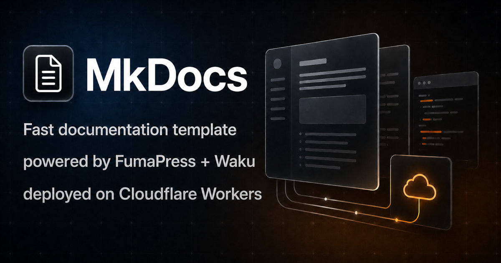

<p align="center">
  
</p>

<h1 align="center">Mkdirs Docs</h1>

<p align="center">
  The bilingual documentation for <a href="https://mkdirs.com">Mkdirs</a>, powered by <a href="https://press.fumadocs.dev">FumaPress</a> and deployed on Cloudflare Workers.
</p>

<p align="center">
  <a href="./LICENSE"></a>
  <a href="https://github.com/MkdirsHQ/mkdirs-docs/stargazers"></a>
  <a href="https://press.fumadocs.dev"></a>
  <a href="https://workers.cloudflare.com"></a>
  <a href="https://www.typescriptlang.org"></a>
</p>

<p align="center">
  <a href="https://docs.mkdirs.com">Documentation</a> ·
  <a href="https://mkdirs.com">Website</a> ·
  <a href="https://github.com/MkdirsHQ/mkdirs-docs/issues">Report a Bug</a>
</p>



## Features

- Content-first documentation with Markdown and MDX
- Static search with keyboard shortcuts
- Responsive navigation, table of contents, and light/dark/system themes
- Locale-aware routing with a customizable language switcher
- Reusable cards, callouts, steps, tabs, accordions, file trees, type tables, Lucide icons, and video embeds
- Per-page Markdown, `llms.txt`, Open Graph images, and sitemap generation
- Static deployment to Cloudflare Workers with Wrangler
- No Worker runtime code or application bindings required

## Tech stack

- [FumaPress](https://press.fumadocs.dev) and [Fumadocs](https://fumadocs.dev)
- [Waku](https://waku.gg) and React
- TypeScript and Tailwind CSS
- [Cloudflare Workers Static Assets](https://developers.cloudflare.com/workers/static-assets/)

## Getting started

### Prerequisites

- Node.js 20.19 or later
- [pnpm](https://pnpm.io)

### Installation

```bash
git clone https://github.com/MkdirsHQ/mkdirs-docs.git
cd mkdirs-docs
pnpm install
pnpm dev
```

Open the local URL printed in the terminal.

### Commands

| Command | Description |
| --- | --- |
| `pnpm dev` | Start the local development server |
| `pnpm build` | Generate the production-ready static site |
| `pnpm check` | Run source generation, TypeScript, build, and Wrangler dry-run checks |
| `pnpm deploy` | Build and deploy the site with Wrangler |

## Deploy to Cloudflare Workers

1. Authenticate Wrangler:

   ```bash
   pnpm exec wrangler login
   ```

2. Update the Worker name and optional custom domain in `wrangler.jsonc`.

3. Validate and deploy:

   ```bash
   pnpm check
   pnpm deploy
   ```

For CI deployments, provide `CLOUDFLARE_API_TOKEN` and `CLOUDFLARE_ACCOUNT_ID` as secrets.

## Contributing

Contributions are welcome.

1. Fork the repository.
2. Create a branch for your change.
3. Run `pnpm check` before committing.
4. Open a pull request with a clear description of the change.

For bugs and feature requests, please [open an issue](https://github.com/MkdirsHQ/mkdirs-docs/issues).

## Author

[OpenFox](https://mksaas.link/fox-x) is an independent developer building products and developer tools. His products include:

- [TanStarter](https://tanstarter.dev) — Ship Faster with TanStack, Cost Less with Cloudflare.
- [MkSaaS](https://mksaas.com) — Make Your AI SaaS Product in a Weekend.
- [MkImage](https://mkimage.ai) — Make Any Images Possible.
- [MkDirs](https://mkdirs.com) — Launch AI-powered directory in 30 minutes.
- [MkDollar](https://mkdollar.com) — The all-in-one platform to help you make first dollar online.

## License

Licensed under the [MIT License](./LICENSE).
