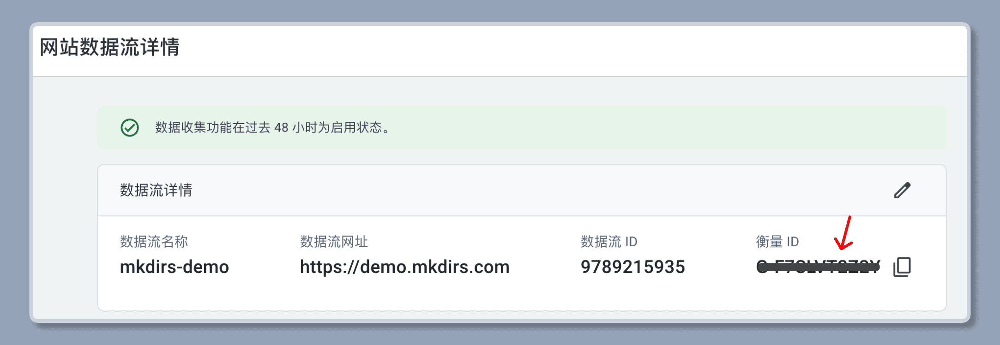
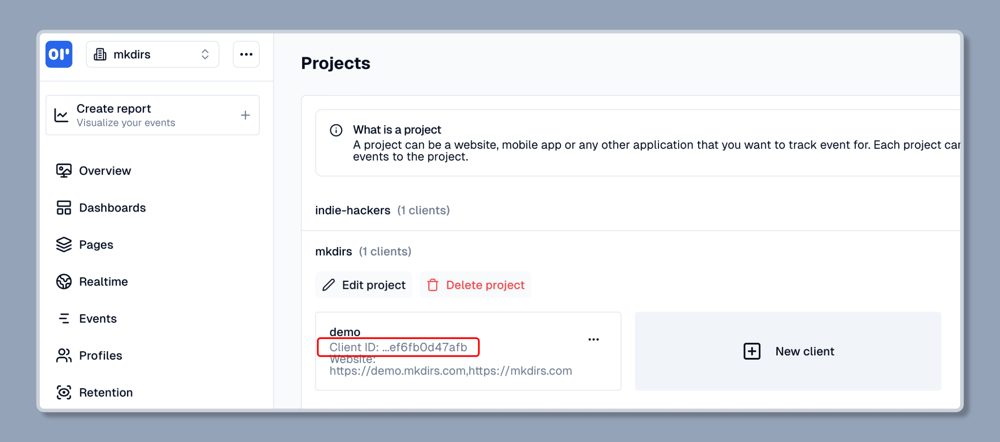

import { Steps } from '@astrojs/starlight/components';

Mkdirs uses [Google Analytics](https://analytics.google.com/) or [OpenPanel](https://openpanel.dev/) as the analytics service, but you can also add other analytics services, and we will support more in the future.

## Google Analytics

Follow the [Google Analytics official guide](https://support.google.com/analytics/answer/9304153) to set up Google Analytics for a website.

Then copy the Google Analytics ID, and set it to the `.env` file.

```bash
# .env
# [only required if you are using Google Analytics]
NEXT_PUBLIC_GOOGLE_ANALYTICS_ID=your_google_analytics_id;
```



## OpenPanel Analytics

<Steps>

1. Create an account on [OpenPanel](https://openpanel.dev//login)

   If you don't have an account, follow [the steps](https://dashboard.openpanel.dev/login) to create your account.

2. Create a new project

   Click on the `Create Project` button, enter the name of your project to create a new one.

3. Create a new client

   Click on the `...` button next to the project name, and select `Projects`.

   Click on the `New Client` button, and enter the domain to create a new client.

4. Get the OpenPanel Client ID

   Once the client is created, copy the `Client ID` and set it to the `.env` file.

    ```bash
    # .env
    # [only required if you are using OpenPanel Analytics]
    NEXT_PUBLIC_OPENPANEL_CLIENT_ID=your_open_panel_client_id;
    ```

    

</Steps>

## Umami Analytics

<Steps>

1. Create an account on [Umami](https://umami.is)

   If you don't have an account, follow the steps to create your account.

2. Create a new website

   After logging in, click on the `Add Website` button and enter your website details.

3. Get the Website ID

   Once the website is created, you'll find the Website ID in the website settings. Copy it and set it along with the script URL in your `.env` file.

   ```bash
   # .env
   # [only required if you are using Umami Analytics]
   NEXT_PUBLIC_UMAMI_WEBSITE_ID=your_website_id
   NEXT_PUBLIC_UMAMI_SCRIPT=https://cloud.umami.is/script.js
   ```

</Steps>

## Plausible Analytics

<Steps>

1. Create an account on [Plausible](https://plausible.io)

   If you don't have an account, follow the steps to create your account.

2. Add a new site

   After logging in, click on the `Add a site` button and enter your domain name.

3. Configure the domain

   Once the site is added, copy your domain name and set it along with the script URL in your `.env` file.

   ```bash
   # .env
   # [only required if you are using Plausible Analytics]
   NEXT_PUBLIC_PLAUSIBLE_DOMAIN=your_domain
   NEXT_PUBLIC_PLAUSIBLE_SCRIPT=https://plausible.io/js/script.js
   ```

</Steps>

## Video tutorial

{/* https://www.youtube.com/embed/O3DEgUjJvhs?list=PLVBbrIi208W_qLhMoEV8-XQi7lrTyPlOM */}
<div style="position: relative; padding-bottom: 56.25%; height: 0; overflow: hidden;">
  <iframe 
    style="position: absolute; top: 0; left: 0; width: 100%; height: 100%;" 
    width="1280" 
    height="720" 
    src="https://www.youtube.com/embed/O3DEgUjJvhs?list=PLVBbrIi208W_qLhMoEV8-XQi7lrTyPlOM" 
    title="【Deploy】【6/8】Environment variables for Analytics —— Launch a directory with Mkdirs template" 
    frameborder="0" 
    allow="accelerometer; autoplay; clipboard-write; encrypted-media; gyroscope; picture-in-picture; web-share" 
    referrerpolicy="strict-origin-when-cross-origin" 
    allowfullscreen
  ></iframe>
</div>

## Further Reading

- [Google Analytics](https://analytics.google.com/)
- [OpenPanel Analytics](https://openpanel.dev/)
