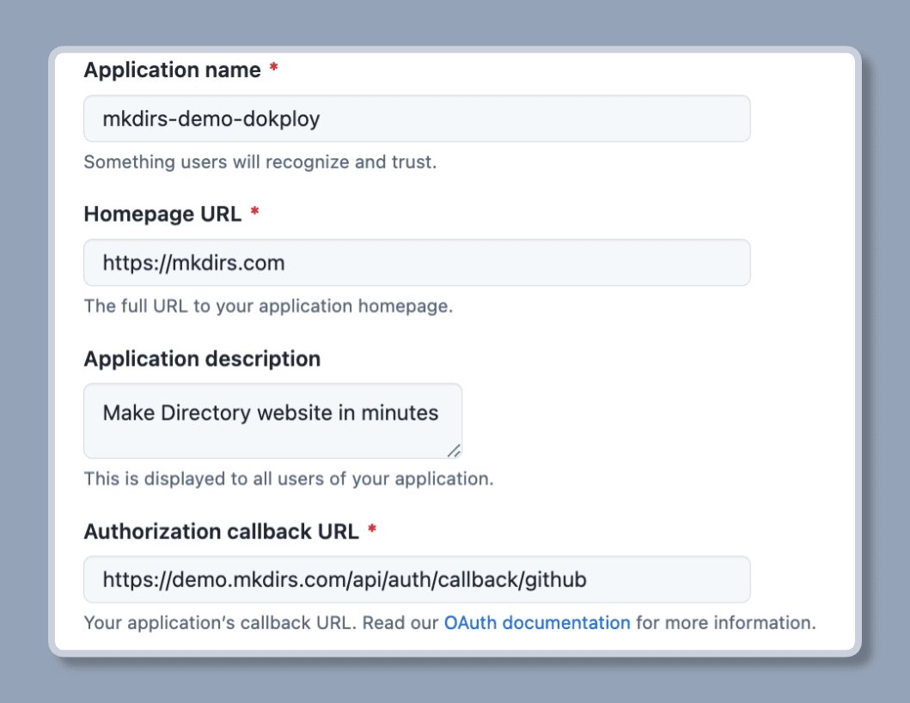

import { Aside } from '@astrojs/starlight/components';
import { Steps } from '@astrojs/starlight/components';

Mkdirs uses [Auth.js v5](https://authjs.dev/) for authentication.

## Configuration

<Steps>

1. Generate the `AUTH_SECRET` variable

    `AUTH_SECRET` is a random value, and you can generate one via running:

    ```bash
    npx auth secret

    # or
    openssl rand -base64 33
    ```

    Then set it to the `.env` file.

    ```bash
    # .env
    # [required]
    AUTH_SECRET=secret
    ```

2. [Optional] Get the GitHub client variables

    If you want to use GitHub as an OAuth provider, you need to update the `AUTH_GITHUB_ID` and `AUTH_GITHUB_SECRET` variables.

    Follow the steps [here](https://authjs.dev/guides/configuring-github) to get the `client_id` and `client_secret` from the [GitHub Developer Settings](https://github.com/settings/developers).

    For the callback URL, it is **`https://your-domain.com/api/auth/callback/github`** or **`http://localhost:3000/api/auth/callback/github`** for local development.

    ```bash
    # .env
    # [only required if you want to support GitHub authentication]
    AUTH_GITHUB_ID = your_secret_client_id
    AUTH_GITHUB_SECRET = your_secret_client
    ```

    <Aside type="caution">
        Please create 2 OAuth applications in the GitHub Developer Settings, one for the production environment and one for the development environment.
        Don't use the same OAuth application for both environments.
    </Aside>

    

3. [Optional] Get the Google client variables

    If you want to use Google as an OAuth provider, you need to update the `AUTH_GOOGLE_ID` and `AUTH_GOOGLE_SECRET` variables.

    You can get the `client_id` and `client_secret` from the [Google Cloud Console](https://console.cloud.google.com/apis/credentials).

    For the callback URL, it is **`https://your-domain.com/api/auth/callback/google`** or **`http://localhost:3000/api/auth/callback/google`** for local development.

    ```bash
    # .env
    # [only required if you want to support Google authentication]
    AUTH_GOOGLE_ID = your_secret_client_id.apps.googleusercontent.com
    AUTH_GOOGLE_SECRET = your_secret_client
    ```

    <Aside type="caution">
        Please create 2 OAuth applications in the Google Cloud Console, one for the production environment and one for the development environment.
        Don't use the same OAuth application for both environments.
    </Aside>

    

</Steps>


## Further Reading

- [Auth.js v5](https://authjs.dev/getting-started/introduction)
- [Auth.js v5 - Environment Variables](https://authjs.dev/guides/environment-variables)
- [Auth.js v5 - OAuth with GitHub](https://authjs.dev/guides/configuring-github)
- [Auth.js v5 - Database Adapter](https://authjs.dev/guides/creating-a-database-adapter)
- [Auth.js v5 - Data Models](https://authjs.dev/concepts/database-models)
- [YouTube Video - Next Auth V5 - Advanced Guide (2024)](https://www.youtube.com/watch?v=1MTyCvS05V4)
