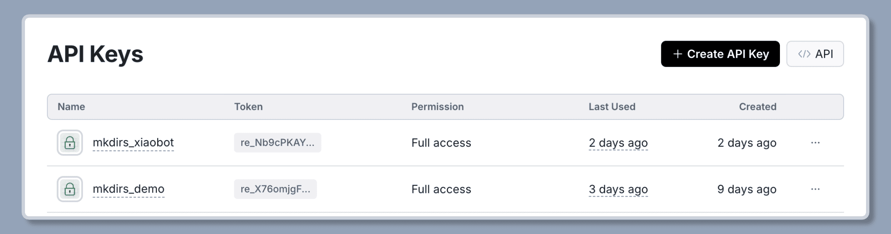
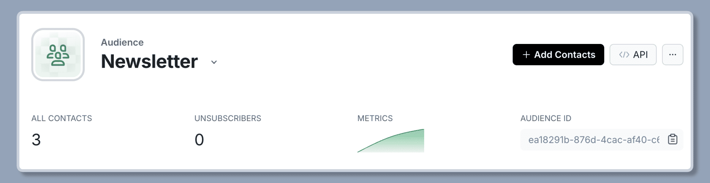

import { Steps } from '@astrojs/starlight/components';

Mkdirs uses [Resend](https://resend.com/) as the email service.

## Configuration

<Steps>

1. Create an account on [Resend](https://resend.com/)

    If don't have an account on Resend, follow their steps to [signup](https://resend.com/signup).

    After signin on Resend, following their steps to [add your domain to Resend](https://resend.com/docs/dashboard/domains/cloudflare).

2. Get the Resend API key

    Click on `API Keys` on the left navigation bar, then click on the `Create API key` button, and set it to the `.env` file.

    ```bash
    # .env
    # [only required if you want to authenticate users by email/password]
    RESEND_API_KEY=your_api_key
    ```

    

3. Set the email address to send the emails from

    When sending an email, for example, signup emails, the email will be sent from the following email address:

    ```bash
    # .env
    # [only required if you want to authenticate users by email/password]
    RESEND_EMAIL_FROM=support@example.com
    ```

4. [Optional] Set the email address to receive the notification emails

    When there is a new submission from a customer, a notification email will be sent to the following email address:

    ```bash
    # .env
    # [only required if you want to receive notification emails]
    RESEND_EMAIL_ADMIN=admin@example.com
    ```

5. [Optional] Get the audience id for newsletter

    Create a new audience in Resend and copy the audience id, then set it to the `.env` file.

    This variable is used to support newsletter subscription on the website.

    ```bash
    # .env
    # [only required if you want to support newsletter]
    RESEND_AUDIENCE_ID=your_audience_id
    ```

    

</Steps>

## Further Reading

- [Resend](https://resend.com/)
- [Resend - Domains](https://resend.com/docs/dashboard/domains/cloudflare)
- [Resend - Email API](https://resend.com/docs/api-reference/emails)
- [Resend - Audiences](https://resend.com/docs/dashboard/audiences/introduction)
- [Resend - Broadcasts](https://resend.com/docs/dashboard/broadcasts/introduction)
- [React Email](https://react.email/docs/introduction)
