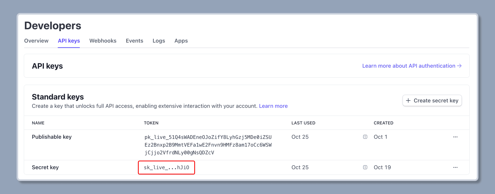
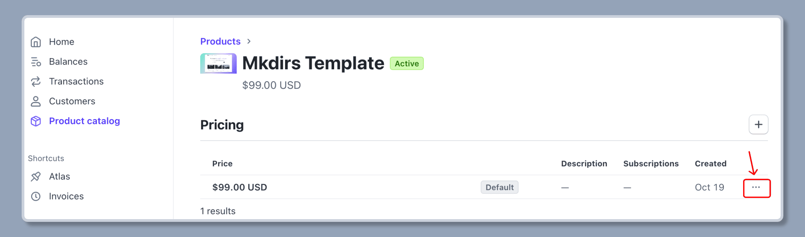
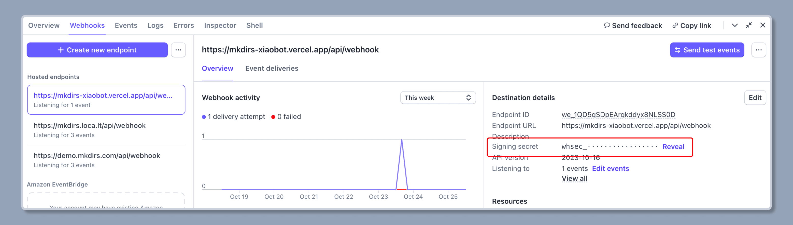

import { Steps } from '@astrojs/starlight/components';

Mkdirs uses [Stripe](https://stripe.com/) as a payment processor.

## Configuration

<Steps>

1. Create an account on [Stripe](https://stripe.com/)

    If don't have an account on Stripe, follow their steps to [signup](https://dashboard.stripe.com/register).

2. Get the Stripe API key

    - Go to your Stripe dashboard.
    - Select `Developers` on the top right navigation bar.
    - Select `API keys` on the menu under `Developers`.
    - Click on the `Reveal live key` (or `Reveal test key` if you are in test mode).
    - Copy the secret key and set it to the `.env` file.

    ```bash
    # .env
    # [only required if you want to support paid submissions]
    STRIPE_API_KEY=your_stripe_api_key
    ```

    

3. Get the product price id

    - Go to your Stripe dashboard.
    - Select `Product Catalog` on the left sidebar.
    - Click on the `+ Create Product` button.
    - Give your product a clear name and set the one-time fee for user submissions.
    - Click on the `Add Product` button to create it.
    - Go to the product detail page, click on the `...` button in the pricing section.
    - Copy the price id and set it to the `.env` file.

    ```bash
    # .env
    # [only required if you want to support paid submissions]
    NEXT_PUBLIC_STRIPE_PRO_PRICE_ID=your_price_id
    ```

    

4. Get the webhook secret

    - Go to your Stripe dashboard.
    - Select `Developers` on the top right navigation bar.
    - Select `Webhooks` on the menu under `Developers`.
    - Click on the `Add an endpoint` button.
    - Enter the endpoint URL where Stripe will send events to, for example, `https://your-domain.com/api/webhook`.
    - Choose the events you want to receive notifications for, common events include `checkout.session.completed`.
    - Copy the webhook secret and set it to the `.env` file.

    ```bash
    # .env
    # [only required if you want to support paid submissions]
    STRIPE_WEBHOOK_SECRET=your_webhook_secret
    ```

    

</Steps>

## To be added in the docs

- Add video tutorial.
- Add detailed steps about creating product and setting price.
- Add detailed steps about setting up webhook and testing in dev environment.
