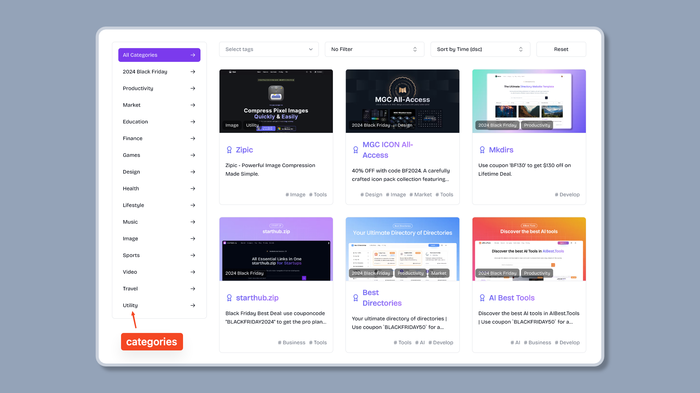
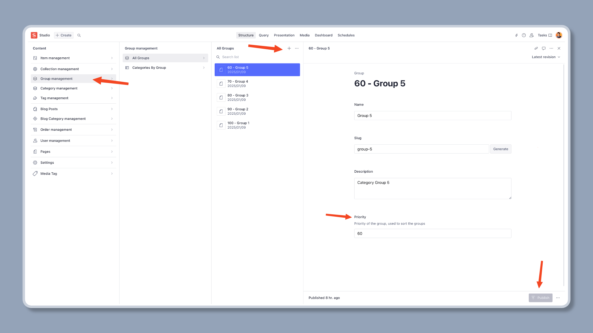

import { Aside } from '@astrojs/starlight/components';

## Add categories

Go to the Sanity Studio, click the `Category Management` button, and then click the `+` button.

Input the category name, and generate the slug, set the description and priority, then click the `Publish` button.


<Aside type="note">
    If you want to group categories, you should add the group first, then you can assign the categories to the group.
</Aside>

After the category is published, you can see the category list in the website like this.



## Add category groups

Go to the Sanity Studio, click the `Group Management` button, and then click the `+` button.

Input the group name, and generate the slug, set the description and priority, then click the `Publish` button.



<Aside type="note">
    Please make sure you have assigned the categories to the group, you can do this by editing the category information.
</Aside>

After the group is published, you can see the group list in the website like this.


The category group is supported by default, if you do not want to show the group, you can disable it by setting the `SUPPORT_CATEGORY_GROUP` to `false` in the `src/lib/constants.ts` file.

```ts
// support category group, default is true (aka, show category group)
// NOTE: if you set true, you should make sure each category belongs to a group
// if you set false, the category will be shown in the root level
export const SUPPORT_CATEGORY_GROUP = false;
```
