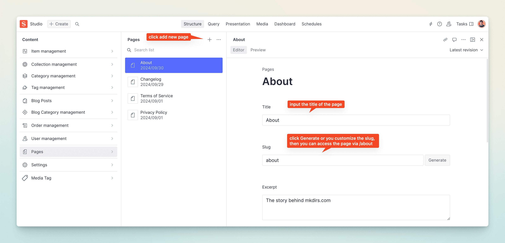

import { Aside } from '@astrojs/starlight/components';

## Add custom pages

Go to the Sanity Studio, click the `Pages` button, and then click the `Create` button.

Input the page title, and generate the slug, then click the `Publish` button.

After the page is published, you can see the page in the website via the URL `/[slug]`.

For example, if the slug is `about`, you can see the page in the website via the URL `/about`.

You can add About page, Contact page, Privacy page, Terms page, etc, in the Sanity Studio.

<Aside type="caution">
    Please make sure the slug is unique, and it is listed in the `publicRoutes` array in the `src/routes.ts` file, otherwise the page will be redirected to the login page.
</Aside>
