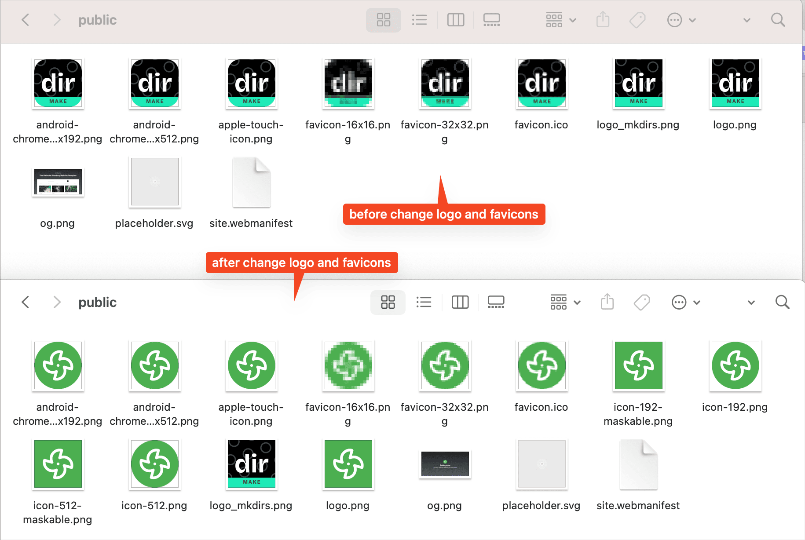

Create a new `logo.png` file and new `favicon.ico` files, put them in the `public` folder.

You can delete original `logo.png` file and `favicon.ico` files.

You can create your logo and favicons using [these tools](https://indiehub.best/collection/the-best-logo-generator-tools-in-2025).

## Video tutorial

{/* https://www.youtube.com/watch?v=GRf3fC4nCXU&list=PLVBbrIi208W-yprj2E6oXu-yxB3Ou522u&index=9 */}

  <iframe 
    style="position: absolute; top: 0; left: 0; width: 100%; height: 100%;" 
    width="1280" 
    height="720" 
    src="https://www.youtube.com/embed/GRf3fC4nCXU?list=PLVBbrIi208W-yprj2E6oXu-yxB3Ou522u" 
    title="【8/9】自定义文案 + LOGO + 主题 —— 基于Mkdirs模板部署上线导航站的全流程记录" 
    frameborder="0" 
    allow="accelerometer; autoplay; clipboard-write; encrypted-media; gyroscope; picture-in-picture; web-share" 
    referrerpolicy="strict-origin-when-cross-origin" 
    allowfullscreen
  ></iframe>

