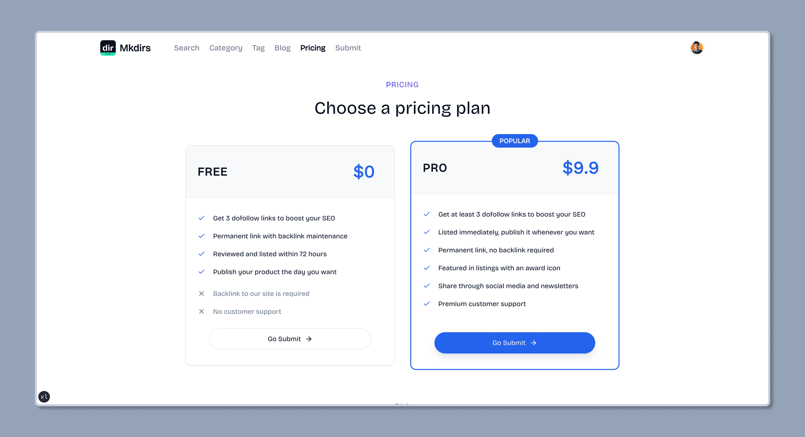

Mkdirs uses Shadcn UI for the theme, and you can customize the color themes in [Shadcn UI Theme](https://ui.shadcn.com/themes), then copy the code and replace the existing code in the `src/styles/globals.css` file.

For example, you can change the color theme to `Blue` by copying the code below to test it.




```css
/* src/styles/globals.css */

@layer base {
  :root {
    --background: 0 0% 100%;
    --foreground: 222.2 84% 4.9%;
    --card: 0 0% 100%;
    --card-foreground: 222.2 84% 4.9%;
    --popover: 0 0% 100%;
    --popover-foreground: 222.2 84% 4.9%;
    --primary: 221.2 83.2% 53.3%;
    --primary-foreground: 210 40% 98%;
    --secondary: 210 40% 96.1%;
    --secondary-foreground: 222.2 47.4% 11.2%;
    --muted: 210 40% 96.1%;
    --muted-foreground: 215.4 16.3% 46.9%;
    --accent: 210 40% 96.1%;
    --accent-foreground: 222.2 47.4% 11.2%;
    --destructive: 0 84.2% 60.2%;
    --destructive-foreground: 210 40% 98%;
    --border: 214.3 31.8% 91.4%;
    --input: 214.3 31.8% 91.4%;
    --ring: 221.2 83.2% 53.3%;
    --radius: 0.5rem;
    --chart-1: 12 76% 61%;
    --chart-2: 173 58% 39%;
    --chart-3: 197 37% 24%;
    --chart-4: 43 74% 66%;
    --chart-5: 27 87% 67%;
  }

  .dark {
    --background: 222.2 84% 4.9%;
    --foreground: 210 40% 98%;
    --card: 222.2 84% 4.9%;
    --card-foreground: 210 40% 98%;
    --popover: 222.2 84% 4.9%;
    --popover-foreground: 210 40% 98%;
    --primary: 217.2 91.2% 59.8%;
    --primary-foreground: 222.2 47.4% 11.2%;
    --secondary: 217.2 32.6% 17.5%;
    --secondary-foreground: 210 40% 98%;
    --muted: 217.2 32.6% 17.5%;
    --muted-foreground: 215 20.2% 65.1%;
    --accent: 217.2 32.6% 17.5%;
    --accent-foreground: 210 40% 98%;
    --destructive: 0 62.8% 30.6%;
    --destructive-foreground: 210 40% 98%;
    --border: 217.2 32.6% 17.5%;
    --input: 217.2 32.6% 17.5%;
    --ring: 224.3 76.3% 48%;
    --chart-1: 220 70% 50%;
    --chart-2: 160 60% 45%;
    --chart-3: 30 80% 55%;
    --chart-4: 280 65% 60%;
    --chart-5: 340 75% 55%;
  }
}
```

## Video tutorial

Currently, there is no video tutorial in English for this part, but you can refer to the following video in Chinese to learn how to customize the information.

### How to customize the information - Video Tutorial in Chinese (for developers)

<div style="position: relative; padding-bottom: 56.25%; height: 0; overflow: hidden;">
  <iframe 
    style="position: absolute; top: 0; left: 0; width: 100%; height: 100%;" 
    width="1280" 
    height="720" 
    src="https://www.youtube.com/embed/GRf3fC4nCXU?list=PLVBbrIi208W-yprj2E6oXu-yxB3Ou522u" 
    title="【8/9】自定义文案 + LOGO + 主题 —— 基于Mkdirs模板部署上线导航站的全流程记录" 
    frameborder="0" 
    allow="accelerometer; autoplay; clipboard-write; encrypted-media; gyroscope; picture-in-picture; web-share" 
    referrerpolicy="strict-origin-when-cross-origin" 
    allowfullscreen
  ></iframe>
</div>

### How to customize the information - Video Tutorial in Chinese (for beginners)

<div style="position: relative; padding-bottom: 56.25%; height: 0; overflow: hidden;">
  <iframe 
    style="position: absolute; top: 0; left: 0; width: 100%; height: 100%;" 
    width="1280" 
    height="720" 
    src="https://www.youtube.com/embed/aRR8R5V1fpQ?list=PLVBbrIi208W9pRjN9dVE8f9pzd6KJrTaw" 
    title="11、导航站自定义" 
    frameborder="0" 
    allow="accelerometer; autoplay; clipboard-write; encrypted-media; gyroscope; picture-in-picture; web-share" 
    referrerpolicy="strict-origin-when-cross-origin" 
    allowfullscreen
  ></iframe>
</div>
