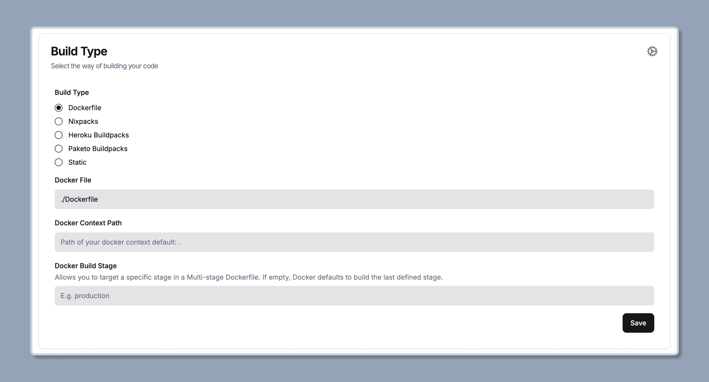

import { Steps } from '@astrojs/starlight/components';

You can easily deploy Mkdirs on [Docker](https://www.docker.com/).

## Deployment with Dockerfile

Mkdirs comes with a pre-configured Docker file, so you can deploy it on any Docker-compatible platform.

```dockerfile
# Dockerfile

# syntax=docker/dockerfile:1
FROM node:20-alpine AS base

# Install dependencies only when needed
FROM base AS deps
# Check https://github.com/nodejs/docker-node/tree/b4117f9333da4138b03a546ec926ef50a31506c3#nodealpine to understand why libc6-compat might be needed.
RUN apk add --no-cache libc6-compat
WORKDIR /app

# Install dependencies
COPY package.json pnpm-lock.yaml* ./
RUN corepack enable pnpm && pnpm i --frozen-lockfile

# Rebuild the source code only when needed
FROM base AS builder
WORKDIR /app
COPY --from=deps /app/node_modules ./node_modules
COPY . .

# Next.js collects completely anonymous telemetry data about general usage.
# Learn more here: https://nextjs.org/telemetry
# Uncomment the following line in case you want to disable telemetry during the build.
# ENV NEXT_TELEMETRY_DISABLED 1

RUN corepack enable pnpm \
  && mv next.config.docker.mjs next.config.mjs \
  && pnpm build

# Production image, copy all the files and run next
FROM base AS runner
WORKDIR /app

ENV NODE_ENV production
# Uncomment the following line in case you want to disable telemetry during runtime.
# ENV NEXT_TELEMETRY_DISABLED 1

RUN addgroup --system --gid 1001 nodejs
RUN adduser --system --uid 1001 nextjs

COPY --from=builder /app/public ./public

# Set the correct permission for prerender cache
RUN mkdir .next
RUN chown nextjs:nodejs .next

# Automatically leverage output traces to reduce image size
# https://nextjs.org/docs/advanced-features/output-file-tracing
COPY --from=builder --chown=nextjs:nodejs /app/.next/standalone ./
COPY --from=builder --chown=nextjs:nodejs /app/.next/static ./.next/static

USER nextjs

EXPOSE 3000

ENV PORT 3000
ENV HOSTNAME "0.0.0.0"

# server.js is created by next build from the standalone output
# https://nextjs.org/docs/pages/api-reference/next-config-js/output
CMD ["node", "server.js"]
```

## Deployment on Dokploy

I personally recommend using [Dokploy](https://dokploy.com/) to deploy Mkdirs, because it's much easier to setup the whole thing and you get the CI/CD pipeline like Vercel out of the box.



## To be added in the docs

- Add video tutorial.
- Add detailed guide about deployment on Docker.
