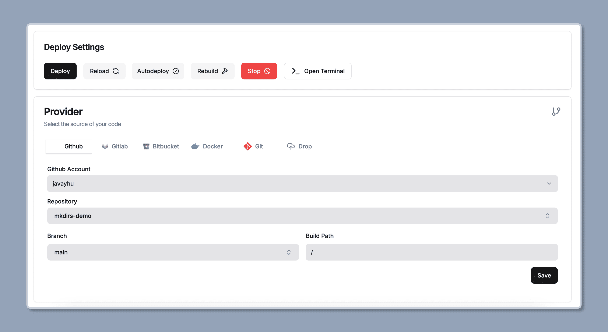
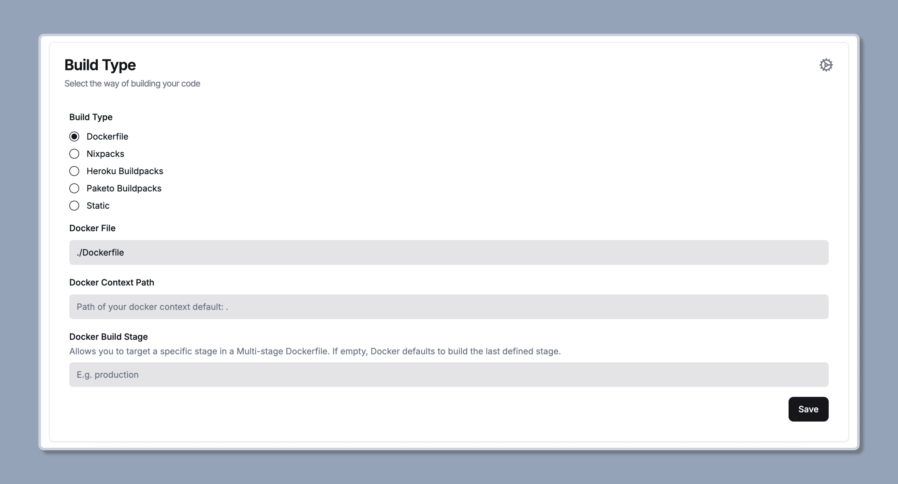
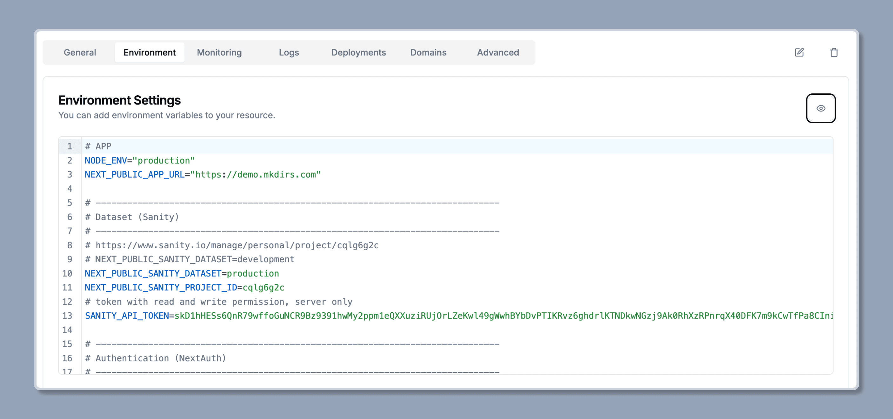
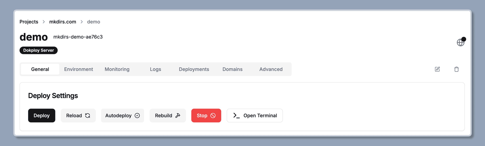
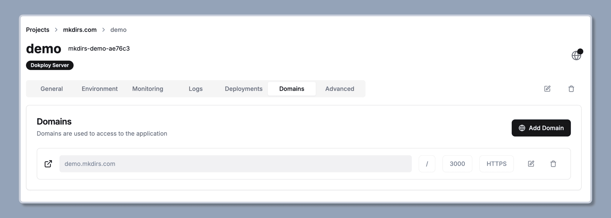

import { Aside } from '@astrojs/starlight/components';
import { Steps } from '@astrojs/starlight/components';

I personally recommend using [Dokploy](https://dokploy.com/) to deploy Mkdirs, because it's much easier to setup the whole thing and you get the automatic CI/CD pipeline like Vercel out of the box.

## Deploy on Dokploy

<Steps>

1. Create a new project on Dokploy

    Click on the `Create project` button and set the project name and description.

2. Create an application in the project

    Click on the `Create services` button and select `Application`, then set the application name and description.

3. Set the source code and build type

    Set the source code to the repository, and set the build type to Dockerfile.

    

    

4. Set the environment variables

    Copy the content from the `.env` file and paste them in environment settings.

    <Aside type="caution">
        1. Environment variables are different in development and production environments.
        2. Add `AUTH_TRUST_HOST=true` to the environment variables.
        3. Add `AUTH_URL=https://your-domain.com/api/auth` to the environment variables.
    </Aside>

     

5. Start to deploy

    Click on `Deploy` and wait for the deployment to finish.

    

6. Set the domain

    Add the domain you want to use, and make sure to check on `HTTPS`.

    

7. Done

    Check the application by visiting the domain you set once the deployment is finished.

</Steps>
