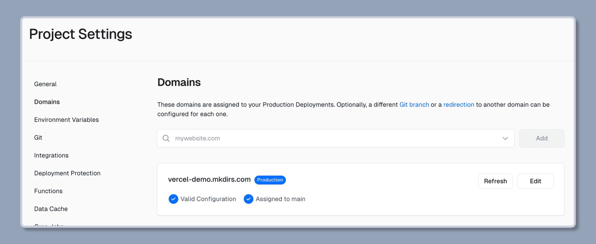

import { Steps } from '@astrojs/starlight/components';

You can easily deploy Mkdirs on [Vercel](https://vercel.com/).

## Deploy on Vercel

<Steps>

1. Create an account on [Vercel](https://vercel.com/)

    If don't have an account on Vercel, follow their steps to [signup](https://vercel.com/signup).

2. Create a new project

    Click on the `Add New Project` button, and select your GitHub repository, then click on the `Import` button.

3. Set the environment variables

    Copy and paste the environment variables from the `.env` file to the `Environment Variables` section, then click on the `Deploy` button.

    

4. Set the domain

    Add the domain you want to use in the `Domains` section, and add the DNS records to your domain provider, then wait for the DNS records to take effect.

    

5. Done

    Wait for the deployment to finish, and your directory website should be live on the web.

</Steps>

## To be added in the docs

- Add video tutorial.
- Add detailed guide about email features, such as newsletter.
