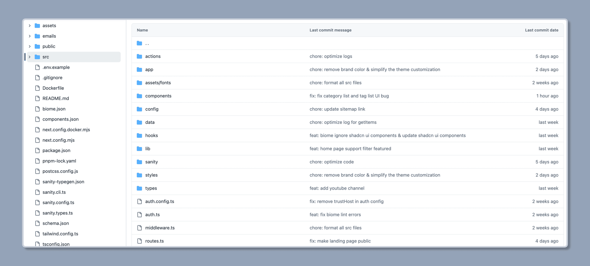
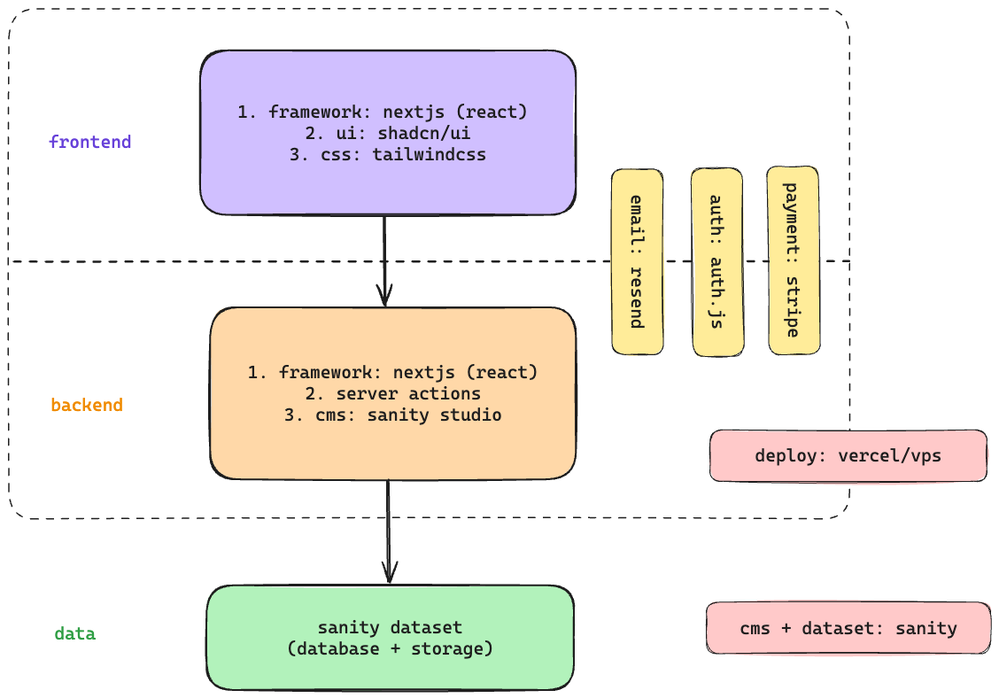
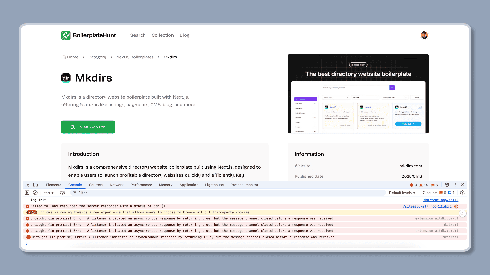
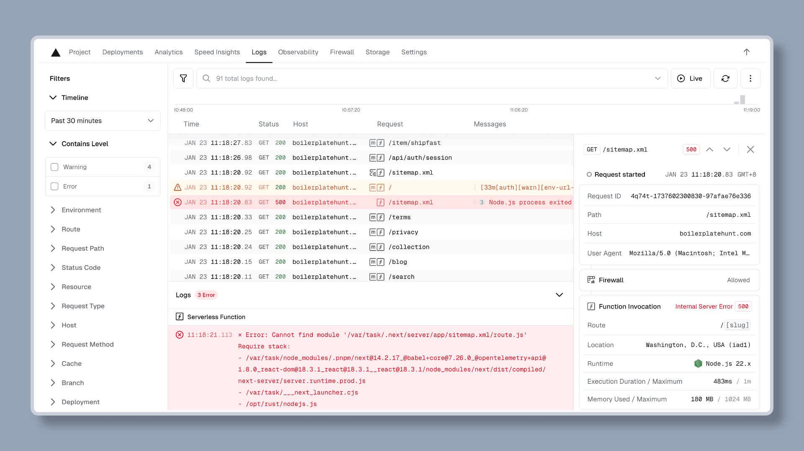
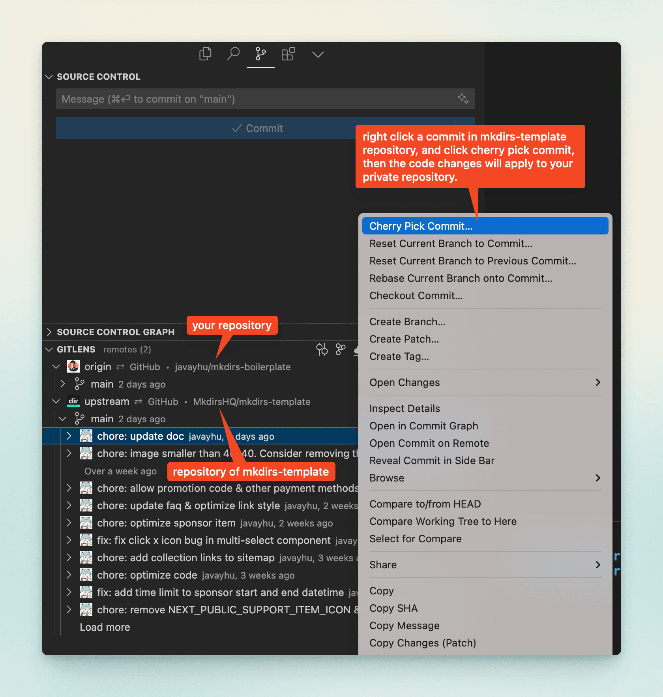

import { Aside } from '@astrojs/starlight/components';
import { Steps } from '@astrojs/starlight/components';

## Folder Structure

It's simply a [Next.js](https://nextjs.org/) project using [Typescript](https://www.typescriptlang.org/), so the folder structure of the Mkdirs is as follows:



## Application Architecture



## How to find the logs

If you met with some errors, you can find the logs in the `console` of the browser (if it is a client error), or in the `terminal` of the server (if it is a server error).

If you are using Vercel to deploy your website, you can find the logs in the `Logs` section of the Vercel dashboard.

**Console Logs**



**Vercel Logs**



## How to batch import data

Mkdirs uses [Sanity](https://www.sanity.io/) as the content management system, so if you want to batch import data, you need to import the data into Sanity, and it's recommended to read the [Sanity documentation](/guide/sanity) before importing the data.

If you are familiar with Sanity, you can refer to the scripts in the `scripts` directory in the root of the project to implement batch import of categories, tags, and items.

By default, there are four scripts in the `scripts` directory in the root of the project: `batch-group.ts`, `batch-category.ts`, `batch-tag.ts`, and `batch-item.ts`, which are used to import category groups, categories, tags, and items, respectively.

You can test importing data by running the command `pnpm batch` after creating a new project, and you can also refer to the other scripts in the directory too, the corresponding commands can be found in the [`package.json` file](https://github.com/MkdirsHQ/mkdirs-template/blob/main/package.json#L27).

```json
"scripts": {
    "dev": "next dev",
    "build": "next build",
    "start": "next start",
    "lint": "next lint",
    "typegen": "sanity schema extract && sanity typegen generate",
    "email": "email dev --dir emails --port 3333",
    "export-user-emails": "tsx scripts/export-user-emails.ts",
    "microlink:fetch": "tsx scripts/explore-microlink.ts fetch",
    "microlink:insights": "tsx scripts/explore-microlink.ts insights",
    "microlink:screenshot": "tsx scripts/explore-microlink.ts screenshot",
    "microlink:fullpage": "tsx scripts/explore-microlink.ts fullpage",
    "aisdk:fetch": "tsx scripts/explore-aisdk.ts fetch",
    "aisdk:structure": "tsx scripts/explore-aisdk.ts structure",
    "item:remove": "tsx scripts/batch-item.ts remove",
    "item:import": "tsx scripts/batch-item.ts import",
    "item:update": "tsx scripts/batch-item.ts update",
    "item:fetch": "tsx scripts/batch-item.ts fetch",
    "batch": "tsx scripts/batch-all.ts",
    "batch:remove": "tsx scripts/batch-all.ts remove",
    "batch:import": "tsx scripts/batch-all.ts import",
    "batch:update": "tsx scripts/batch-all.ts update"
},
```

<Aside type="caution">
    1、By default, these scripts cannot fully meet your needs, they only provide a basic implementation, you need to adjust them according to your actual needs.  
    2、There are some scripts in the directory that are used to test the interfaces of [Vercel AI SDK](https://sdk.vercel.ai/) and [Microlink](https://microlink.io/), you can also refer to them to implement your custom features.
</Aside>


## How to format the code

We use [Biome](https://biomejs.dev/) to format the code, and it's already configured in the project.

You can install the [Biome extension](https://marketplace.visualstudio.com/items?itemName=biomejs.biome) in vscode to format the code automatically.

Or you can run the following command to format the code:

```bash
biome format
```

## How to sync the code

If you have followed the steps in the [Installation](/installation), and you have a repository named `@your-github-username/your-mkdirs`.

Follow the steps below to sync the source code from `@MkdirsHQ/mkdirs-template` to your own repository if some updates are available, for example, new features or bug fixes.

<Steps>

1. Add the upstream repository

    First, you need to add the original repository as a remote repository. 
    
    You can name it `upstream`, and run the following command in your local repository:

    ```bash
    git remote add upstream https://github.com/MkdirsHQ/mkdirs-template.git
    ```

2. Fetch upstream changes
    
    Run the following command to fetch all branches and commits from the original repository:

    ```bash
    git fetch upstream
    ```

3. Switch to your main branch
    
    Make sure you're on your main branch (usually main or master):

    ```bash
    git checkout main
    ```

4. Merge upstream changes
    
    Now, merge the changes from the upstream main branch into your local main branch:

    ```bash
    git merge upstream/main --allow-unrelated-histories
    ```

    If you don't want to merge all the changes from the upstream main branch, you can also cherry-pick the specific commits that you want to apply to your local main branch:
    

    ```bash
    git cherry-pick <commit-hash>
    ```

    If you prefer to use vscode extension, you can use [GitLens](https://marketplace.visualstudio.com/items?itemName=eamodio.gitlens) to sync the code.

    

5. Resolve conflicts (if any)

    If conflicts occur during the merge (mainly due to you have made some changes to the source code already), you'll need to resolve them manually. 
    
    After resolving, use `git add` to add the modified files, then use `git commit` to commit the changes.

6. Push to your own repository
    
    Finally, push the updated local main branch to your own repository:

    ```bash
    git push origin main
    ```

</Steps>

By following these steps, you can keep your fork in sync with the original repository. It's recommended to perform this process regularly to ensure your fork doesn't fall too far behind.

## Further Reading

- [Next.js](https://nextjs.org/)
- [Course: Learn React Foundation](https://nextjs.org/learn/react-foundations)
- [Course: Learn Next.js](https://nextjs.org/learn)
