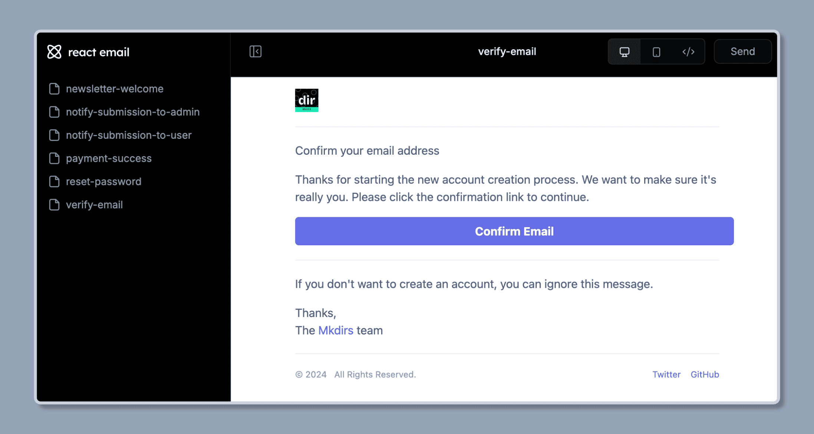

## Start the email server

Run the following command to start the email server, and you can see the email server is running on `http://localhost:3333`.

```bash
pnpm email
```



## Change or add new emails

The email files are in the `emails` folder, you can change the email files to your own emails.

Or you can add new email files to the `emails` folder, preview the email in the browser.
