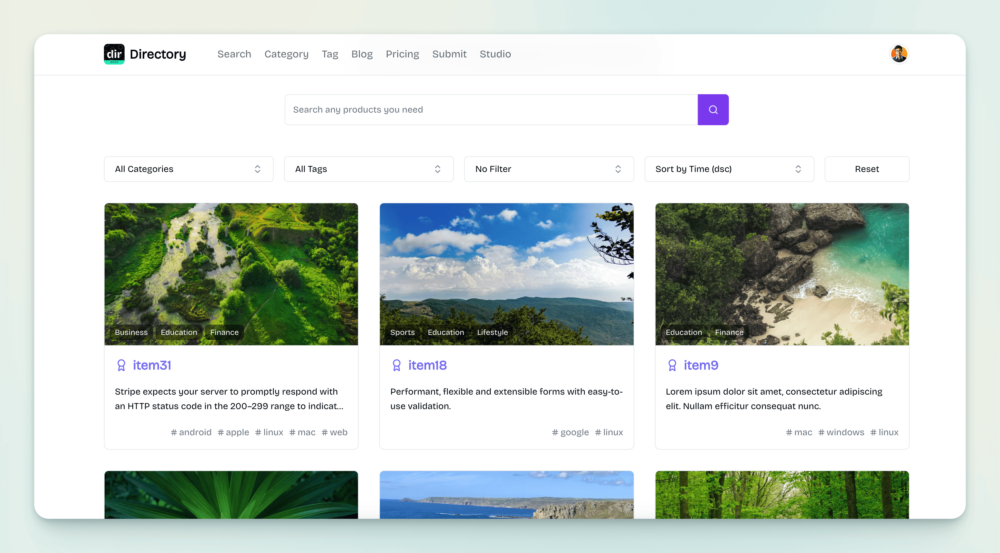
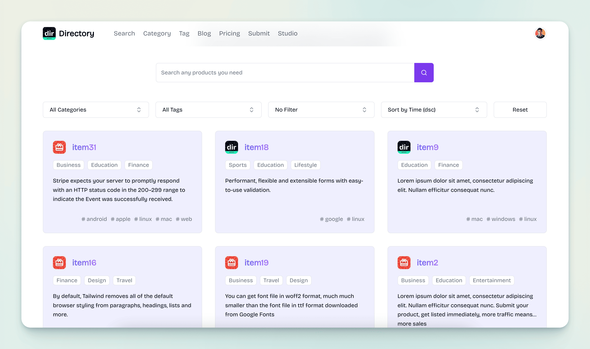

import { Aside } from '@astrojs/starlight/components';

Mkdirs support two kinds of Item Card: `Card with Image` (default) and `Card with Icon`.

Item Card with Image ([item-card.tsx](https://github.com/MkdirsHQ/mkdirs-template/blob/main/src/components/item/item-card.tsx)):



Item Card with Icon ([item-card-2.tsx](https://github.com/MkdirsHQ/mkdirs-template/blob/main/src/components/item/item-card-2.tsx)):




`Card with Image` is the default style, and you can change it to `Card with Icon` by setting the `NEXT_PUBLIC_SUPPORT_ITEM_ICON` to `true` in the `.env` file.

```.env
# -----------------------------------------------------------------------------
# Website configuration
# -----------------------------------------------------------------------------
# show item icon in item grid, default is false (aka, show item cover image)
NEXT_PUBLIC_SUPPORT_ITEM_ICON=true
```

<Aside type="note">
    - If you change to `Card with Image`, you need to add image to all items.
    - If you change to `Card with Icon`, you need to add icon and image to all items.
    - If you change to `Card with Icon`, you can also use ItemCard with Image component.
</Aside>
