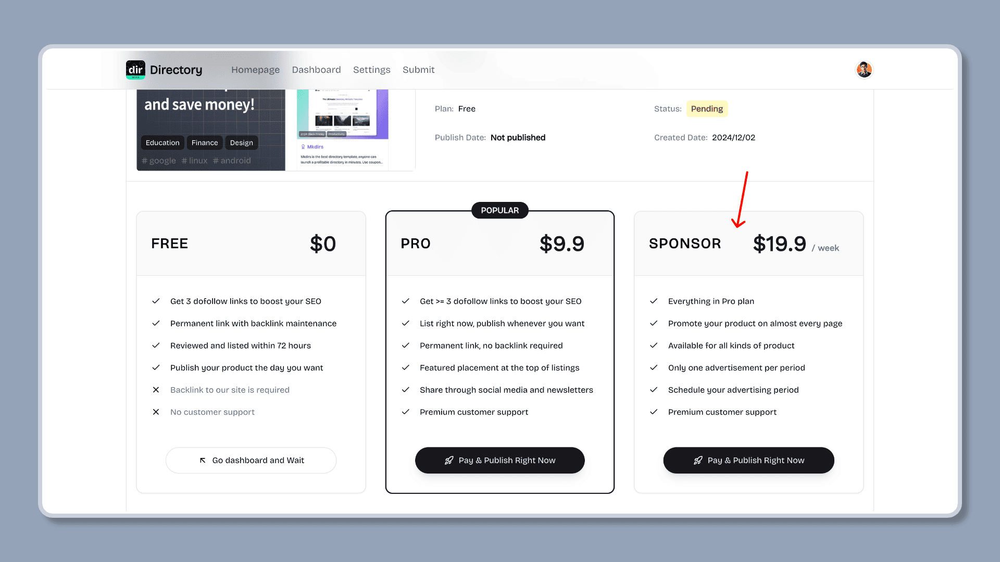
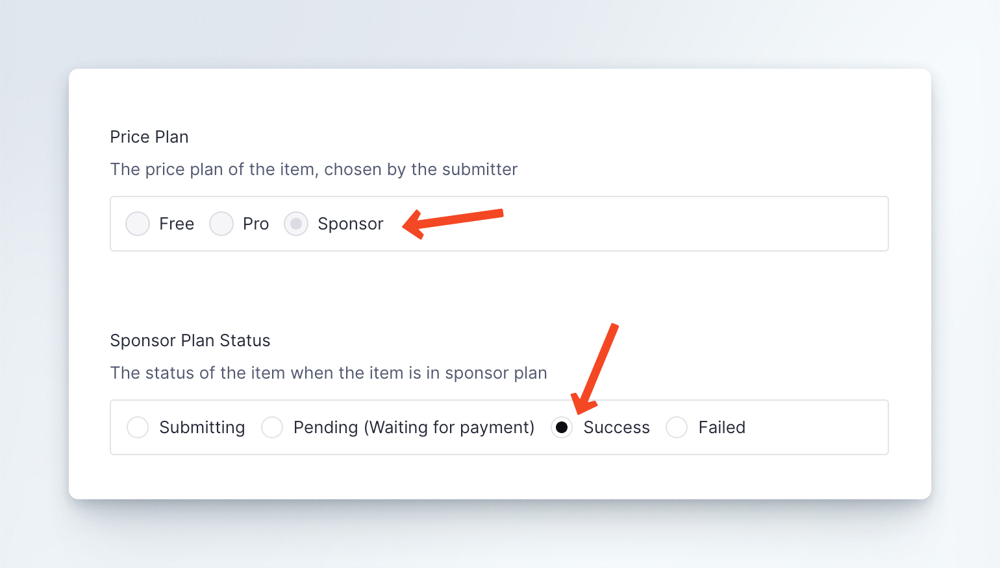
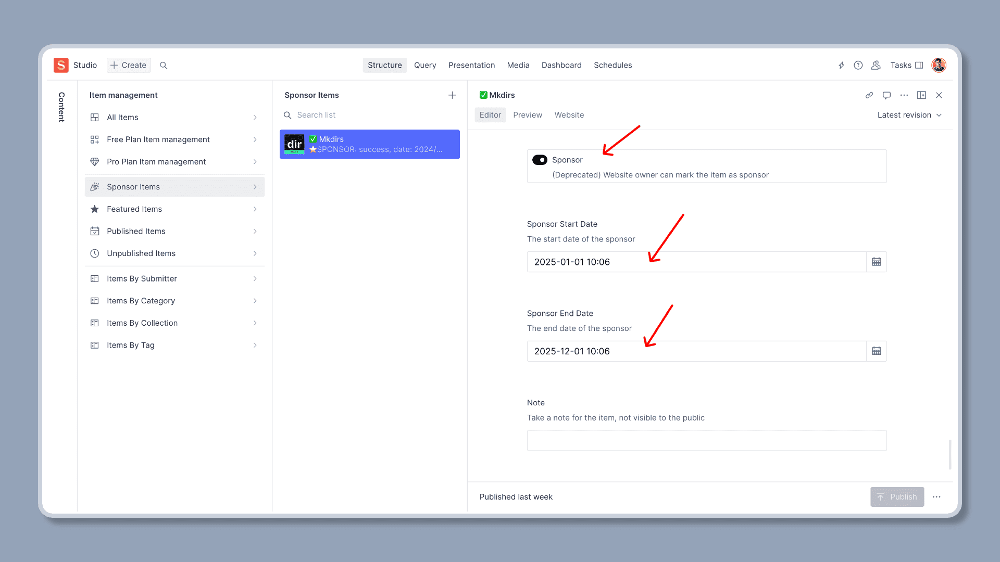
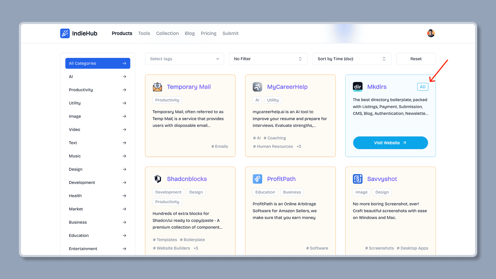
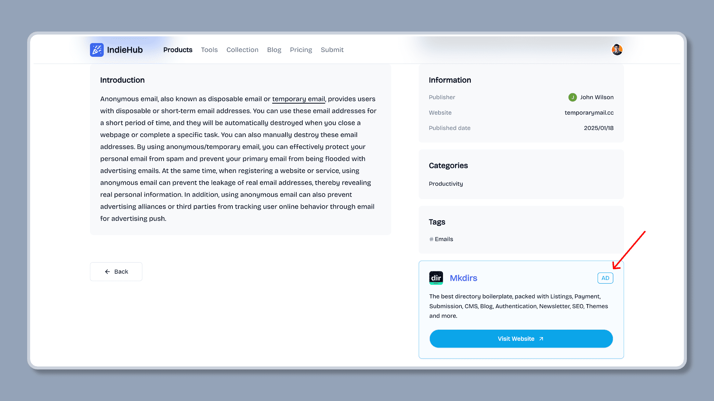

import { Aside } from '@astrojs/starlight/components';
import { Steps } from '@astrojs/starlight/components';

Sponsor ads are one of the main sources of revenue for directories. Sponsor ads are displayed in the list pages or detail pages. Mkdirs template supports sponsor ads submission and display, only one sponsor ad can be displayed at a time. 

The default process for displaying sponsor ads is as follows.

## Display Sponsor Ads

<Steps>

1. User fills out the submission form and pays the sponsor fee

    User clicks the "Submit" button on the directory website, fills out the form, and pays the sponsor fee.

    <Aside type='caution'>
        Please make sure you have set the `NEXT_PUBLIC_STRIPE_SPONSOR_PRICE_ID` in the `.env` file, so that the sponsor price plan will be displayed in the `Payment` page. Please refer to the [Stripe](/configuration/stripe) configuration section for details.
    </Aside>

    

2. Admin communicates with the user to set the display time of the sponsor ad

    The admin communicates with the user to set the display time of the sponsor ad, and then sets the display time of the sponsor ad in Sanity Studio, and checks the `Sponsor` option.

    <Aside type='caution'>
        Mkdirs template does not support users to directly set the display time of the sponsor ad. The admin needs to communicate with the user to determine the time, and then set the display time of the sponsor ad in Sanity Studio. The reason is that the display time of the sponsor ad needs to be determined based on the number and time of the sponsor ads on the current directory website. Currently, the template displays only one sponsor ad at a time, so the admin needs to manually set the display time of the sponsor ad to avoid conflicts in the display time of the sponsor ads.
    </Aside>

    

    

3. The directory website automatically displays the sponsor ad

    After the display time of the sponsor ad is set, the directory website will automatically display the sponsor ad at the specified time.

    

    

</Steps>

