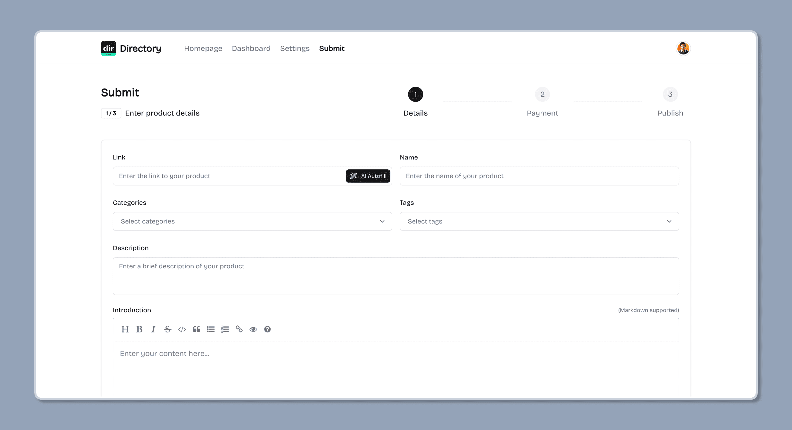
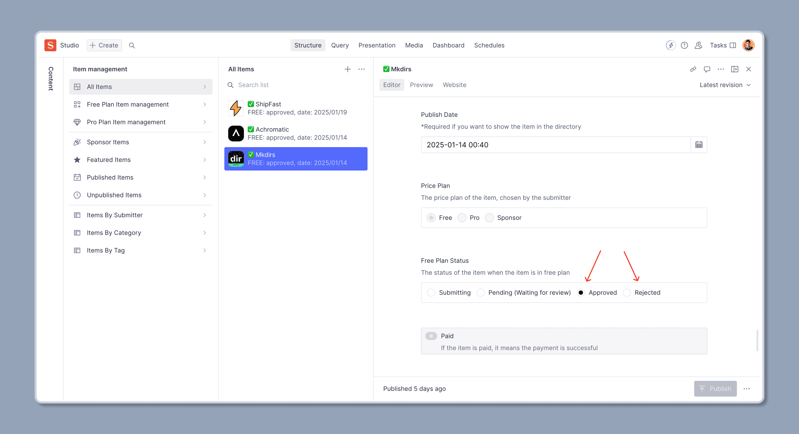
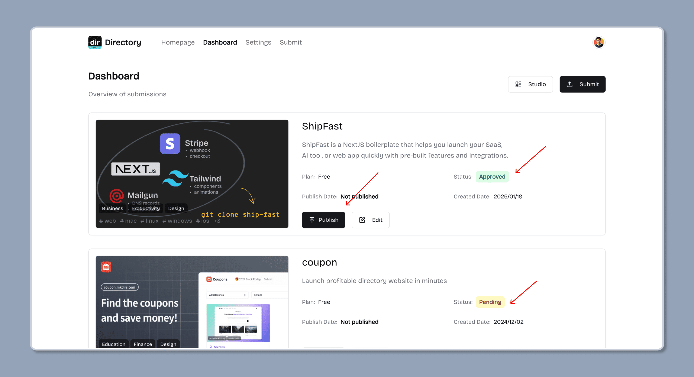
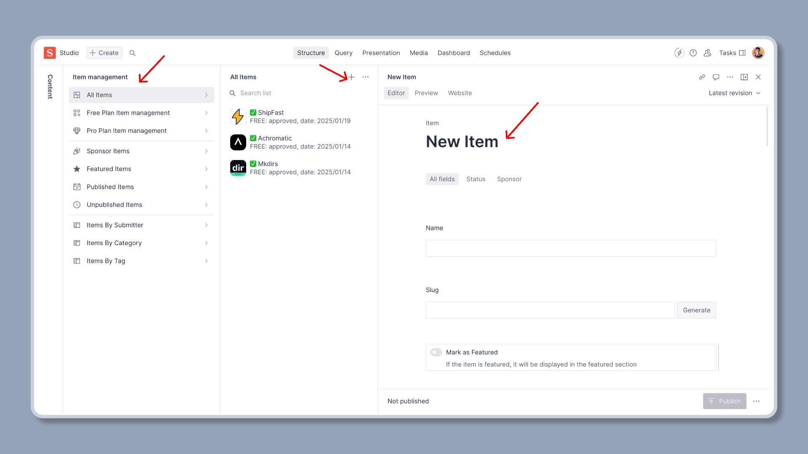
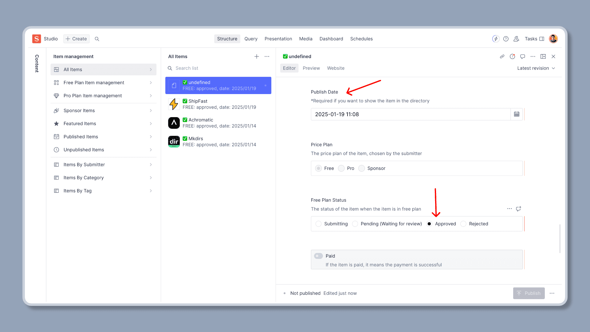

import { Aside } from '@astrojs/starlight/components';
import { Steps } from '@astrojs/starlight/components';

## How users submit new item to the directory

<Steps>

1. Users fill in the submission form

    Users click the "Submit" button on the directory page, and fill in the form with the required information, then submit to review.

    <Aside type="tip">
        The submission form supports AI Autofill, users can click the "AI Autofill" button to let the AI fill in the form, or they can fill in the form manually.
    </Aside>

    

2. Admins review the submission and approve it or reject it

    Admins will review the submission, and approve it or reject it, if reject it, a rejection message will be sent to the user.

    

3. Users publish the submission

    After the submission is approved, users can publish the submission to the directory by clicking the "Publish" button whenever they want. After publishing, the item will be displayed in the directory.

    

</Steps>

## How admins submit new item to the directory

Admins can submit new item to the directory by clicking the "Submit" button on the directory page like users, or by adding a new item in the Sanity Studio directly.

Please make sure to set the `Publish Date` field, and the `Free Plan Status` field to `approved` before publishing.

After publishing, the item will be displayed in the directory.
