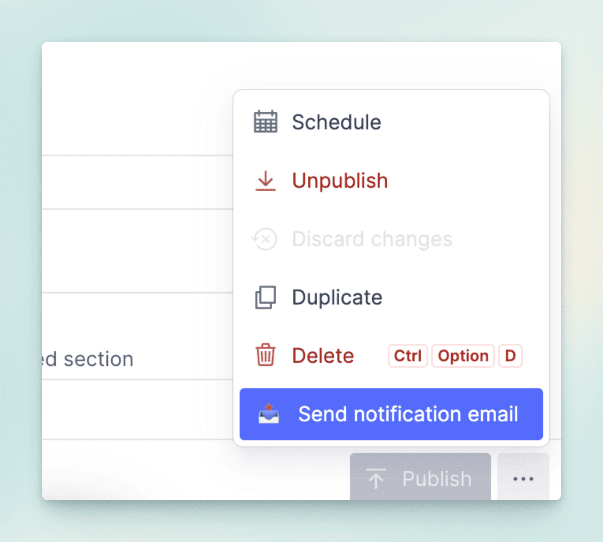
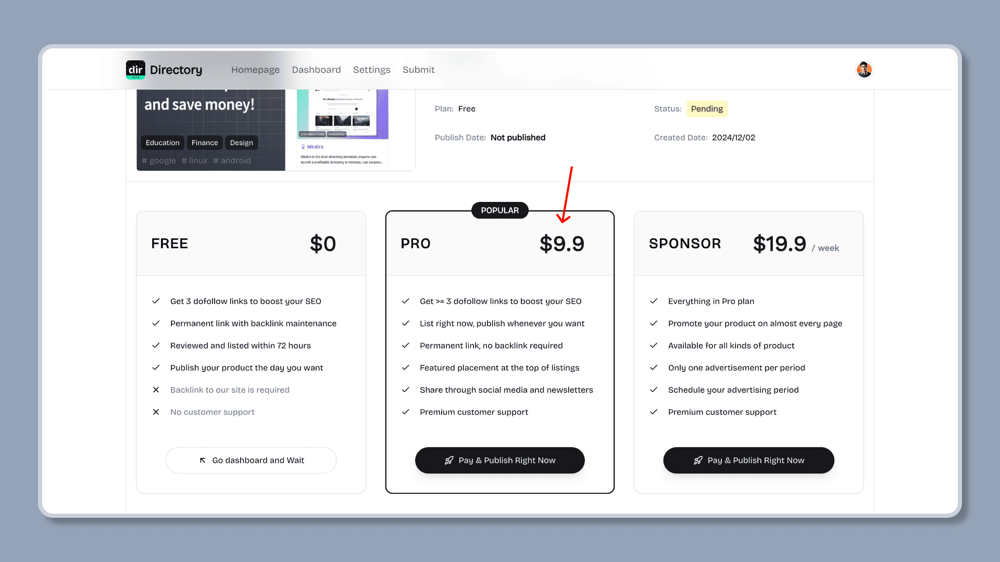

import { Aside } from '@astrojs/starlight/components';
import { Steps } from '@astrojs/starlight/components';

## Free Submission

### How users submit new item to the directory

<Steps>

1. Users fill in the submission form

    Users click the "Submit" button on the directory page, and fill in the form with the required information, then submit to review.

    <Aside type="tip">
        1. The submission form supports AI Autofill, users can click the "AI Autofill" button to let the AI fill in the form, or they can fill in the form manually.
        2. We recommend using Google Gemini model, because it has a larger context window, the success rate is higher, and it is free to use.
        3. The AI Autofill feature is disabled by default, if you want to enable it, please set the `SUPPORT_AI_SUBMIT` environment variable to `true` in the `.env` file.
        4. Please note that the AI Autofill feature is not 100% accurate, and it may fail to fill in the form if the page content is not relevant or the SEO information is not accurate.
    </Aside>

    

2. Admins review the submission and approve it or reject it

    Admins will review the submission, and approve it or reject it, if reject it, a rejection message will be sent to the user.

    

    <Aside type="tip">
        20250215 Update: When an admin reviews a submission, whether it is **approved** or **rejected**, they can click the `Send notification email` button to notify the submitter.
    </Aside>

    

3. Users publish the submission

    After the submission is approved, users can publish the submission to the directory by clicking the "Publish" button whenever they want. After publishing, the item will be displayed in the directory.

    

</Steps>

### How admins submit new item to the directory

Admins can submit new item to the directory by clicking the "Submit" button on the directory page like users, or by adding a new item in the Sanity Studio directly.

Please make sure to set the `Publish Date` field, and the `Free Plan Status` field to `approved` before publishing. After publishing, the item will be displayed in the directory. Because Sanity has cache for API requests, it may take a few minutes to see the content on the directory page.

## Paid Submission

Users click the "Submit" button on the directory website, fill out the form, and pay the `PRO` fee.

After payment, the admin does not need to review it, and the user can publish it immediately or wait for a suitable time to publish it.

## Video tutorial

This video demonstrates how to submit a new item to the directory for free.

  <iframe 
    style="position: absolute; top: 0; left: 0; width: 100%; height: 100%;" 
    width="1280" 
    height="720" 
    src="https://www.youtube.com/embed/QNxort8UYTQ" 
    title="【Test】【11/14】 Free Submission Flow —— Launch a directory with Mkdirs template" 
    frameborder="0" 
    allow="accelerometer; autoplay; clipboard-write; encrypted-media; gyroscope; picture-in-picture; web-share" 
    referrerpolicy="strict-origin-when-cross-origin" 
    allowfullscreen
  ></iframe>

This video demonstrates how to submit a new item to the directory after payment.

  <iframe 
    style="position: absolute; top: 0; left: 0; width: 100%; height: 100%;" 
    width="1280" 
    height="720" 
    src="https://www.youtube.com/embed/iZ620iy9ATg" 
    title="【Test】【12/14】Paid Submission Flow —— Launch a directory with Mkdirs template" 
    frameborder="0" 
    allow="accelerometer; autoplay; clipboard-write; encrypted-media; gyroscope; picture-in-picture; web-share" 
    referrerpolicy="strict-origin-when-cross-origin" 
    allowfullscreen
  ></iframe>

