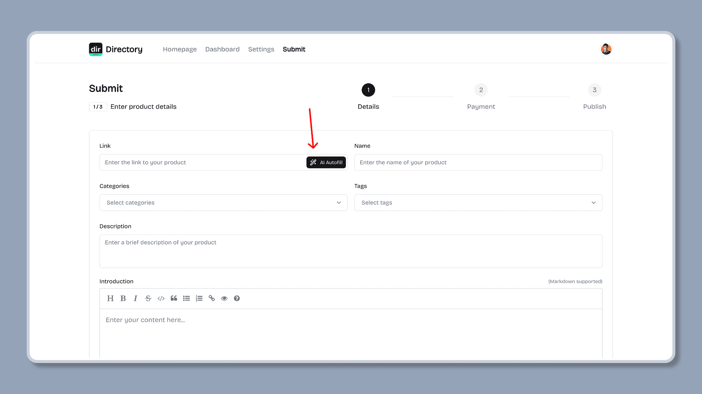

import { Aside } from '@astrojs/starlight/components';
import { Steps } from '@astrojs/starlight/components';

Mkdirs 在提交界面使用 AI 模型来分析网站的内容，并将分析结果自动填充到提交表单中，从而提高提交流程的效率。

Mkdirs 使用 [Vercel AI SDK](https://sdk.vercel.ai/) 作为 AI 模型的封装，并默认支持 [OpenAI ChatGPT](https://openai.com/)、[Google Gemini](https://gemini.google.com/) 和 [DeepSeek](https://www.deepseek.com/) 3个模型，可以根据导航站的需求选择使用。

## 配置

<Steps>

1. 确定要使用的 AI 模型

   您可以选择使用 `google`、`deepseek` 或 `openai` 作为 AI 模型，并在 `.env` 文件中设置 `DEFAULT_AI_PROVIDER` 变量。

   <Aside type="tip">
      1、默认是没有配置 AI 模型，所以不会启用 AI 自动填表功能。  
      2、如果您想使用其他 AI 模型，请参考 [Vercel AI SDK](https://sdk.vercel.ai/) 文档，添加其他 AI 模型的依赖库，然后配置到 Mkdirs 中即可。
   </Aside>

   ```bash
   # .env
   # [only required if you are using AI models to auto fill the submission form]
   # default ai provider: ``, `google`, `deepseek`, `openai`
   # -----------------------------------------------------------------------------
   DEFAULT_AI_PROVIDER=
   ```

2. 获取对应 AI 模型的 API Key

   2.1 获取 Google Gemini API Key

   获取 API Key 的链接：[Google Gemini API Key](https://aistudio.google.com/apikey)

   ```bash
   # .env
   # [only required if you are using Google Gemini]
   # NOTE: if you set `DEFAULT_AI_PROVIDER=google`, you should set this API_KEY
   # -----------------------------------------------------------------------------
   GOOGLE_GENERATIVE_AI_API_KEY=
   ```

   2.2 获取 DeepSeek API Key

   获取 API Key 的链接：[DeepSeek API Key](https://platform.deepseek.com/api_keys)

   ```bash
   # .env
   # [only required if you are using DeepSeek]
   # NOTE: if you set `DEFAULT_AI_PROVIDER=deepseek`, you should set this API_KEY
   # -----------------------------------------------------------------------------
   DEEPSEEK_API_KEY=
   ```

   2.3 获取 OpenAI ChatGPT API Key

   获取 API Key 的链接：[OpenAI ChatGPT API Key](https://platform.openai.com/settings/organization/api-keys)

   ```bash
   # .env
   # [only required if you are using OpenAI]
   # NOTE: if you set `DEFAULT_AI_PROVIDER=openai`, you should set this API_KEY
   # -----------------------------------------------------------------------------
   OPENAI_API_KEY=
   ```

3. 设置启用 AI 自动填表的功能

   如果需要启用 AI 模型实现自动填表的功能，请将 `SUPPORT_AI_SUBMIT` 设置为 `true`。

   <Aside type="tip">
      1、如果启用 AI 自动填表功能后遇到什么问题，可将 `SUPPORT_AI_SUBMIT` 设置为 `false`来禁用 AI 自动填表功能，待问题修复后再启用。  
      2、AI 自动填表功能默认是关闭的，所以不会启用 AI 自动填表功能。之所以使用单独的 `SUPPORT_AI_SUBMIT` 变量来控制，是因为 AI 模型将来可能用于其他功能，所以每个功能都需要单独的变量来控制。
   </Aside>

   ```bash
   # src/lib/constants.ts
   # support AI submit, default is false
   # NOTE: if you set true, you should make sure the AI provider
   # and the API_KEY is set in the env variables.
   # if something is wrong in AI submit, you can set false to disable it.
   export const SUPPORT_AI_SUBMIT = true;
   ```

</Steps>

配置完成之后，如果开启 AI 自动填表功能，在提交表单时，就会出现 "AI 自动填充" 按钮，点击该按钮，AI 模型会自动解析网页内容并自动填充表单。



## 进一步阅读

- [Vercel AI SDK](https://sdk.vercel.ai/)
- [DeepSeek API Key](https://platform.deepseek.com/api_keys)
- [Google Gemini API Key](https://aistudio.google.com/apikey)
- [OpenAI ChatGPT API Key](https://platform.openai.com/settings/organization/api-keys)
