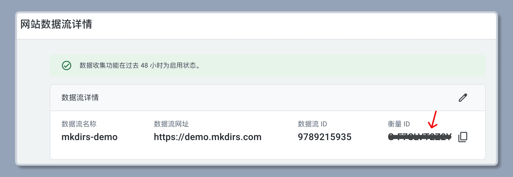

import { Steps } from '@astrojs/starlight/components';

Mkdirs 使用 [Google Analytics](https://analytics.google.com/) 或 [OpenPanel](https://openpanel.dev/) 作为 Analytics 服务，但您也可以添加其他 Analytics 服务，我们将在未来支持更多服务。

## Google Analytics

按照 [官方指南](https://support.google.com/analytics/answer/9304153) 为网站设置 Google Analytics。

然后复制 Google Analytics ID，并将其设置到 `.env` 文件中。

```bash
# .env
# [only required if you are using Google Analytics]
NEXT_PUBLIC_GOOGLE_ANALYTICS_ID=your_google_analytics_id;
```



## OpenPanel Analytics

<Steps>

1. 在 [OpenPanel](https://openpanel.dev//login) 创建一个账户

   按照 [步骤](https://dashboard.openpanel.dev/login) 创建您的账户。

2. 创建一个新项目

   点击 `Create Project` 按钮，输入项目名称以创建一个新项目。

3. 创建一个新客户端

   点击项目名称旁边的 `...` 按钮，并选择 `Projects`。

   点击 `New Client` 按钮，并输入域名以创建一个新客户端。

4. 获取 OpenPanel 客户端 ID

   一旦客户端创建完成，复制 `Client ID`，并将其设置到 `.env` 文件中。

    ```bash
    # .env
    # [only required if you are using OpenPanel]
    NEXT_PUBLIC_OPENPANEL_CLIENT_ID=your_open_panel_client_id;
    ```

    

</Steps>

## 视频教程

{/* https://www.youtube.com/embed/O3DEgUjJvhs?list=PLVBbrIi208W_qLhMoEV8-XQi7lrTyPlOM */}
<div style="position: relative; padding-bottom: 56.25%; height: 0; overflow: hidden;">
  <iframe 
    style="position: absolute; top: 0; left: 0; width: 100%; height: 100%;" 
    width="1280" 
    height="720" 
    src="https://www.youtube.com/embed/O3DEgUjJvhs?list=PLVBbrIi208W_qLhMoEV8-XQi7lrTyPlOM" 
    title="【Deploy】【6/8】Environment variables for Analytics —— Launch a directory with Mkdirs template" 
    frameborder="0" 
    allow="accelerometer; autoplay; clipboard-write; encrypted-media; gyroscope; picture-in-picture; web-share" 
    referrerpolicy="strict-origin-when-cross-origin" 
    allowfullscreen
  ></iframe>
</div>

## 延伸阅读

- [Google Analytics](https://analytics.google.com/)
- [OpenPanel](https://openpanel.dev/)
