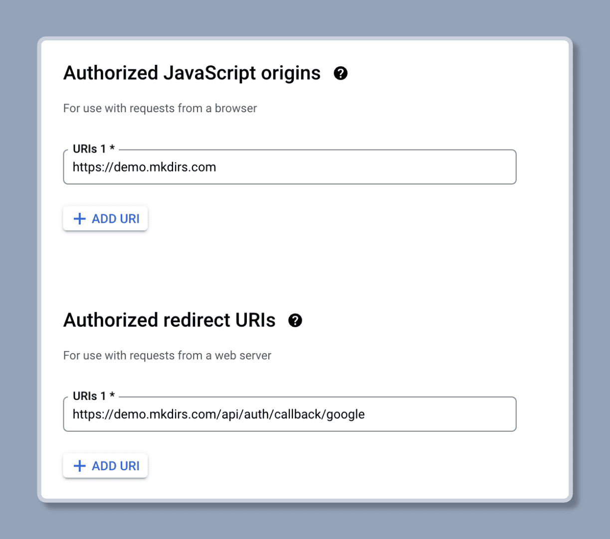

import { Aside } from '@astrojs/starlight/components';
import { Steps } from '@astrojs/starlight/components';

Mkdirs 使用 [Auth.js v5](https://authjs.dev/) 进行身份认证，支持邮箱+密码、GitHub、Google 三种认证方式。

## 配置

<Steps>

1. 生成 `AUTH_SECRET` 变量

    `AUTH_SECRET` 是一个随机值，您可以通过运行以下命令生成一个：

    ```bash
    npx auth secret

    # or
    openssl rand -base64 32
    ```

    然后将它设置到 `.env` 文件中。

    ```bash
    # .env
    # [required]
    AUTH_SECRET=secret
    ```

2. [可选] 获取 GitHub 客户端变量

    如果您想使用 GitHub 作为 OAuth 提供商，您需要更新 `AUTH_GITHUB_ID` 和 `AUTH_GITHUB_SECRET` 变量。

    按照 [这里](https://authjs.dev/guides/configuring-github) 的步骤，从 [GitHub Developer Settings](https://github.com/settings/developers)上，获取 `client_id` 和 `client_secret`。

    对于回调 URL，在线上环境下，它是 **`https://your-domain.com/api/auth/callback/github`**，在本地开发环境下，它是 **`http://localhost:3000/api/auth/callback/github`**。

    ```bash
    # .env
    # [only required if you want to support GitHub authentication]
    AUTH_GITHUB_ID = your_secret_client_id
    AUTH_GITHUB_SECRET = your_secret_client
    ```

    <Aside type="caution">
        请在 GitHub 开发者设置中创建**两个**不同的 OAuth 应用程序，一个用于生产环境，一个用于开发环境。
        **不要在两个环境中使用相同的 OAuth 应用程序。**
    </Aside>

    

3. [可选] 获取 Google 客户端变量

    如果您想使用 Google 作为 OAuth 提供商，您需要更新 `AUTH_GOOGLE_ID` 和 `AUTH_GOOGLE_SECRET` 变量。

    您可以从 [Google Cloud Console](https://console.cloud.google.com/apis/credentials) 获取 `client_id` 和 `client_secret`。

    对于回调 URL，在线上环境下，它是 **`https://your-domain.com/api/auth/callback/google`**，在本地开发环境下，它是 **`http://localhost:3000/api/auth/callback/google`**。

    ```bash
    # .env
    # [only required if you want to support Google authentication]
    AUTH_GOOGLE_ID = your_secret_client_id.apps.googleusercontent.com
    AUTH_GOOGLE_SECRET = your_secret_client
    ```

    <Aside type="caution">
        请在 Google Cloud Console 中创建两个不同的 OAuth 应用程序，一个用于线上环境，一个用于本地开发环境。
        **不要在两个不同的环境中，使用相同的 OAuth 应用程序。**
    </Aside>

    

</Steps>


## 特别注意

1. 请注意，环境变量在开发环境和生产环境中是不同的，请确保为生产环境和开发环境创建两个不同的 OAuth 应用程序。

2. 如果您仍然遇到身份验证问题，例如 `redirect_uri_mismatch` 或其他问题，您可以尝试将以下环境变量添加到 `.env` 文件中，这2个环境变量一般仅在生产环境中设置即可。

    ```bash
    # .env
    AUTH_TRUST_HOST=true
    AUTH_URL=https://your-domain.com/api/auth
    ```


## 视频教程

视频教程有2个版本，一个是开发者教程，一个是初学者教程，请根据自己的实际情况选择观看。

### 配置 Authjs 环境变量 - 开发者教程

<div style="position: relative; padding-bottom: 56.25%; height: 0; overflow: hidden;">
  <iframe 
    style="position: absolute; top: 0; left: 0; width: 100%; height: 100%;" 
    width="1280" 
    height="720" 
    src="https://www.youtube.com/embed/w8_5DxZlPMI?list=PLVBbrIi208W-yprj2E6oXu-yxB3Ou522u" 
    title="【5/9】配置 Authjs 相关的环境变量 —— 基于Mkdirs模板部署上线导航站的全流程记录" 
    frameborder="0" 
    allow="accelerometer; autoplay; clipboard-write; encrypted-media; gyroscope; picture-in-picture; web-share" 
    referrerpolicy="strict-origin-when-cross-origin" 
    allowfullscreen
  ></iframe>
</div>

### 配置 Authjs 环境变量 - 初学者教程

<div style="position: relative; padding-bottom: 56.25%; height: 0; overflow: hidden;">
  <iframe 
    style="position: absolute; top: 0; left: 0; width: 100%; height: 100%;" 
    src="https://www.youtube.com/embed/L2X0xH-eiKQ?list=PLVBbrIi208W9pRjN9dVE8f9pzd6KJrTaw" 
    title="7、配置Auth和Analytics" 
    frameborder="0" 
    allow="accelerometer; autoplay; clipboard-write; encrypted-media; gyroscope; picture-in-picture; web-share" 
    referrerpolicy="strict-origin-when-cross-origin" 
    allowfullscreen
  ></iframe>
</div>

### Next Auth V5 教程

如果您对 Next Auth V5 感兴趣，可以参考以下视频教程，它是一个更高级更全面的 Next Auth V5 指南，比官方文档好得多。

<div style="position: relative; padding-bottom: 56.25%; height: 0; overflow: hidden;">
  <iframe 
    style="position: absolute; top: 0; left: 0; width: 100%; height: 100%;" 
    width="1280" 
    height="720" 
    src="https://www.youtube.com/embed/1MTyCvS05V4" 
    title="Next Auth V5 - Advanced Guide (2024)" 
    frameborder="0" 
    allow="accelerometer; autoplay; clipboard-write; encrypted-media; gyroscope; picture-in-picture; web-share" 
    referrerpolicy="strict-origin-when-cross-origin" 
    allowfullscreen>
  </iframe>
</div>

## 延伸阅读

- [Auth.js v5](https://authjs.dev/getting-started/introduction)
- [Auth.js v5 - Environment Variables](https://authjs.dev/guides/environment-variables)
- [Auth.js v5 - OAuth with GitHub](https://authjs.dev/guides/configuring-github)
- [Auth.js v5 - Database Adapter](https://authjs.dev/guides/creating-a-database-adapter)
- [Auth.js v5 - Data Models](https://authjs.dev/concepts/database-models)
- [YouTube Video - Next Auth V5 - Advanced Guide (2024)](https://www.youtube.com/watch?v=1MTyCvS05V4)
