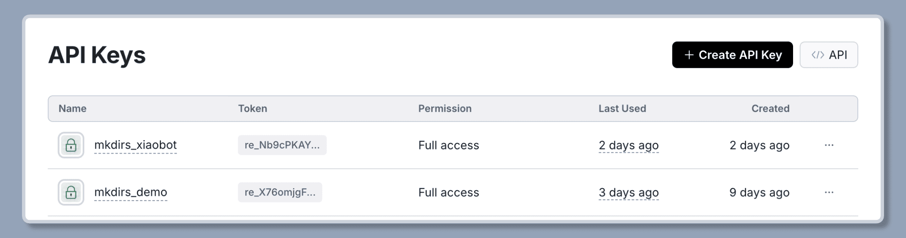

import { Steps } from '@astrojs/starlight/components';

Mkdirs 使用 [Resend](https://resend.com/) 作为邮件服务，支持发送邮件、接收通知邮件、支持订阅功能。

## 配置

<Steps>

1. 在 [Resend](https://resend.com/) 创建一个账户

    如果您没有 Resend 账户，请按照他们提供的步骤进行 [注册](https://resend.com/signup)。

    登录 Resend 后，按照他们提供的步骤 [将您的域名添加到 Resend](https://resend.com/docs/dashboard/domains/cloudflare)。

2. 获取 Resend API 密钥

    点击左侧导航栏的 `API Keys`，点击 `Create API key` 按钮，将密钥设置到 `.env` 文件中。

    请确保 API 密钥具有 `Full Access` 权限。

    ```bash
    # .env
    # [only required if you want to authenticate users by email/password]
    RESEND_API_KEY=your_api_key
    ```

    

3. 设置发送邮件的邮箱地址

    发送邮件时，例如注册邮件，邮件将来自以下邮箱地址：

    ```bash
    # .env
    # [only required if you want to authenticate users by email/password]
    RESEND_EMAIL_FROM=support@example.com
    ```

4. [可选] 设置接收通知邮件的邮箱地址

    当有新的提交时，将发送通知邮件到以下邮箱地址：

    ```bash
    # .env
    # [only required if you want to receive notification emails]
    RESEND_EMAIL_ADMIN=admin@example.com
    ```

5. [可选] 获取订阅的 ID

    在 Resend 中创建一个新订阅，复制订阅 ID，然后将其设置到 `.env` 文件中。

    该变量用于支持网站的订阅功能，如果不需要订阅功能，可以跳过此步骤。

    ```bash
    # .env
    # [only required if you want to support newsletter]
    RESEND_AUDIENCE_ID=your_audience_id
    ```

    

</Steps>

## 视频教程

视频教程有2个版本，一个是开发者教程，一个是初学者教程，请根据自己的实际情况选择观看。

### 配置 Resend 环境变量 - 开发者教程
<div style="position: relative; padding-bottom: 56.25%; height: 0; overflow: hidden;">
  <iframe 
    style="position: absolute; top: 0; left: 0; width: 100%; height: 100%;" 
    src="https://www.youtube.com/embed/Q1hiPFzgaeo?list=PLVBbrIi208W-yprj2E6oXu-yxB3Ou522u" 
    title="【3/9】配置 Resend 相关的环境变量 —— 基于Mkdirs模板部署上线导航站的全流程记录" 
    frameborder="0" 
    allow="accelerometer; autoplay; clipboard-write; encrypted-media; gyroscope; picture-in-picture; web-share" 
    referrerpolicy="strict-origin-when-cross-origin" 
    allowfullscreen
  ></iframe>
</div>

### 配置 Resend 环境变量 - 初学者教程

<div style="position: relative; padding-bottom: 56.25%; height: 0; overflow: hidden;">
  <iframe 
    style="position: absolute; top: 0; left: 0; width: 100%; height: 100%;" 
    src="https://www.youtube.com/embed/zL-i54BrS2w?list=PLVBbrIi208W9pRjN9dVE8f9pzd6KJrTaw" 
    title="3、在Resend上绑定域名" 
    frameborder="0" 
    allow="accelerometer; autoplay; clipboard-write; encrypted-media; gyroscope; picture-in-picture; web-share" 
    referrerpolicy="strict-origin-when-cross-origin" 
    allowfullscreen
  ></iframe>
</div>

<div style="position: relative; padding-bottom: 56.25%; height: 0; overflow: hidden;">
  <iframe 
    style="position: absolute; top: 0; left: 0; width: 100%; height: 100%;" 
    src="https://www.youtube.com/embed/33ciilos3Zw?list=PLVBbrIi208W9pRjN9dVE8f9pzd6KJrTaw" 
    title="6、配置Resend环境变量" 
    frameborder="0" 
    allow="accelerometer; autoplay; clipboard-write; encrypted-media; gyroscope; picture-in-picture; web-share" 
    referrerpolicy="strict-origin-when-cross-origin" 
    allowfullscreen
  ></iframe>
</div>


## 延伸阅读

- [Resend](https://resend.com/)
- [Resend - Domains](https://resend.com/docs/dashboard/domains/cloudflare)
- [Resend - Email API](https://resend.com/docs/api-reference/emails)
- [Resend - Audiences](https://resend.com/docs/dashboard/audiences/introduction)
- [Resend - Broadcasts](https://resend.com/docs/dashboard/broadcasts/introduction)
- [React Email](https://react.email/docs/introduction)
