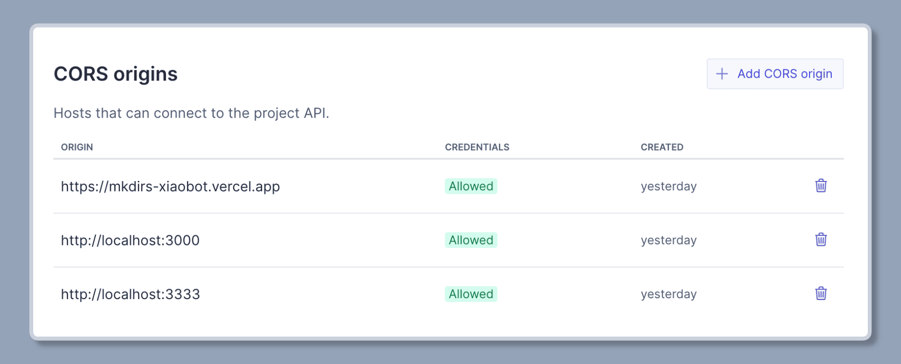

import { Aside } from '@astrojs/starlight/components';
import { Steps } from '@astrojs/starlight/components';

Mkdirs 使用 [Sanity](https://www.sanity.io/) 作为 CMS，您可以通过 Sanity Studio 管理网站所有内容（包括用户数据、导航数据、文章数据、图片等），您不再需要配置其他数据库或存储。

## 配置

<Steps>

1. 在 [Sanity](https://www.sanity.io/) 创建一个账户

    如果您没有 Sanity 账户，请按照他们提供的步骤进行 [注册](https://www.sanity.io/login/sign-up)。

2. 创建一个新项目

    登录 Sanity 后，您可以在 [这里](https://www.sanity.io/manage?new-project) 创建新项目。

3. 获取项目 ID

    创建项目后，您可以在项目名称下看到项目 ID。

    ```bash
    # .env
    # [required] sanity project id
    NEXT_PUBLIC_SANITY_PROJECT_ID=your_project_id
    ```

4. 获取数据集

    默认数据集是 `production`，您可以使用默认数据集或创建一个新数据集。

    <Aside type="caution">
        如果您想分离生产环境和开发环境，您可以为开发环境创建一个新数据集，并为生产环境和开发环境设置不同的数据集名称。
    </Aside>

    ```bash
    # .env
    # [required] production by default, you can set your own dataset name
    NEXT_PUBLIC_SANITY_DATASET=your_dataset
    ```

5. 获取 API 令牌

    进入项目 API 设置，点击 `Add API token` 按钮，创建一个新令牌，权限是 `Editor`，并将其设置到 `.env` 文件中。

    ```bash
    # .env
    # [required] sanity api token
    SANITY_API_TOKEN=your_api_token
    ```

6. 配置 CORS 来源

    进入项目 API 设置，点击 `Add CORS origin` 按钮，添加您的域名，例如线上环境的 **`https://your-domain.com`** 或本地开发的 **`http://localhost:3000`**。

    它将用于允许您通过 `/studio` 路径访问 Sanity Studio，例如 `https://your-domain.com/studio` 或 `http://localhost:3000/studio`。

    <Aside type="caution">
        确保您将域名的来源添加到 CORS 来源中，否则您将无法访问 Sanity Studio (也就是，网站的管理后台)，建议将 `http://localhost:3000` 和 `https://your-domain.com` 都添加到 CORS 来源中。
    </Aside>

    

</Steps>

## 视频教程

视频教程有2个版本，一个是开发者教程，一个是初学者教程，请根据自己的实际情况选择观看。

### 配置 Sanity 环境变量 - 开发者教程

<div style="position: relative; padding-bottom: 56.25%; height: 0; overflow: hidden;">
  <iframe
    style="position: absolute; top: 0; left: 0; width: 100%; height: 100%;"
    width="1280" 
    height="720" 
    src="https://www.youtube.com/embed/HaoYpSv5R1o?list=PLVBbrIi208W-yprj2E6oXu-yxB3Ou522u" 
    title="【2/9】配置 Sanity 相关的环境变量 —— 基于Mkdirs模板部署上线导航站的全流程记录" 
    frameborder="0" 
    allow="accelerometer; autoplay; clipboard-write; encrypted-media; gyroscope; picture-in-picture; web-share" 
    referrerpolicy="strict-origin-when-cross-origin" 
    allowfullscreen
  ></iframe>
</div>

### 配置 Sanity 环境变量 - 初学者教程

<div style="position: relative; padding-bottom: 56.25%; height: 0; overflow: hidden;">
  <iframe
    style="position: absolute; top: 0; left: 0; width: 100%; height: 100%;"
    width="1280" 
    height="720" 
    src="https://www.youtube.com/embed/zfpK_lpbito?list=PLVBbrIi208W9pRjN9dVE8f9pzd6KJrTaw" 
    title="5、配置Sanity环境变量" 
    frameborder="0" 
    allow="accelerometer; autoplay; clipboard-write; encrypted-media; gyroscope; picture-in-picture; web-share" 
    referrerpolicy="strict-origin-when-cross-origin" 
    allowfullscreen
  ></iframe>
</div>

## 延伸阅读

- [Sanity](https://www.sanity.io/)
- [Sanity Content Lake](https://www.sanity.io/docs/datastore)
- [Sanity Studio](https://www.sanity.io/docs/sanity-studio)
- [Sanity Plugins](https://www.sanity.io/plugins)
- [Sanity CLI](https://www.sanity.io/docs/cli-reference)
- [Sanity Courses](https://www.sanity.io/learn)
- [Course: Day one with Sanity](https://www.sanity.io/learn/course/day-one-with-sanity-studio)
- [Course: Sanity Typed content with Sanity TypeGen](https://www.sanity.io/learn/course/typescripted-content)
- [Cheatsheet: GROQ](https://www.sanity.io/docs/query-cheat-sheet)
- [Cheatsheet: Migrating content](https://www.sanity.io/docs/content-migration-cheatsheet)
- [Sanity docs for Localization](https://www.sanity.io/docs/localization)
- [Sanity docs for Block Content](https://www.sanity.io/docs/block-content)
