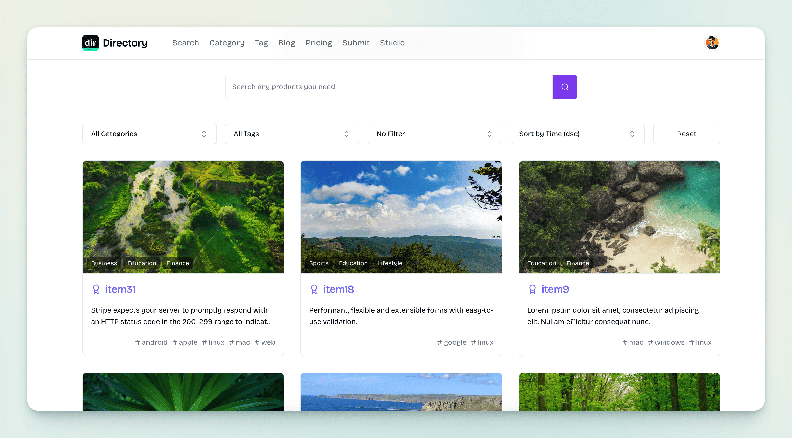
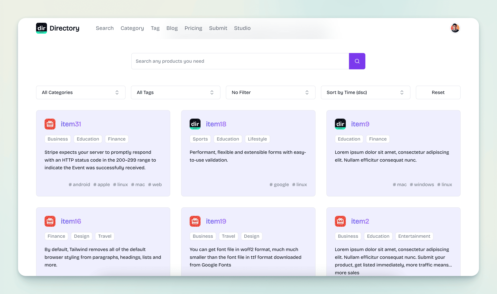

import { Aside } from '@astrojs/starlight/components';

Mkdirs模板支持两种卡片样式：`带封面图样式` 和 `带图标样式` (默认)。

带封面图样式 ([item-card.tsx](https://github.com/MkdirsHQ/mkdirs-template/blob/main/src/components/item/item-card.tsx)):



带图标样式 ([item-card-2.tsx](https://github.com/MkdirsHQ/mkdirs-template/blob/main/src/components/item/item-card-2.tsx)):




`带图标样式` 是默认样式，您可以通过修改 `src/config/site.ts` 文件中的 `SUPPORT_ITEM_ICON` 为 `false` 来将其更改为 `带封面图样式`。

```ts
export const SUPPORT_ITEM_ICON = false;
```

<Aside type="note">
    - 如果您将样式更改为 `带封面图样式`，您需要为所有项目添加封面图。
    - 如果您将样式更改为 `带图标样式`，您需要为所有项目添加图标和封面图。
    - 如果您将样式更改为 `带图标样式`，您也可以使用带封面图样式的组件。
</Aside>
