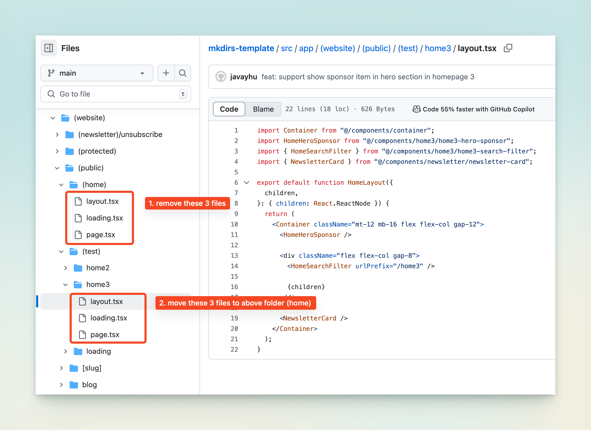

import { Aside } from '@astrojs/starlight/components';

## 添加自定义页面

前往 Sanity Studio，点击 `Pages` 按钮，然后点击 `Create` 按钮。

输入页面标题，并生成 slug，然后点击 `Publish` 按钮。

页面发布后，您可以在网站上通过 URL `/[slug]` 访问该页面。

例如，如果 slug 是 `about`，您可以通过 URL `/about` 访问该页面。

您可以在 Sanity Studio 中添加关于页面、联系页面、隐私页面、条款页面等。

<Aside type="caution">
    请确保 slug 是唯一的，并且它被列在 `src/routes.ts` 文件中的 `publicRoutes` 数组中，否则页面将被重定向到登录页面。
</Aside>

## 修改首页

Mkdirs 模板有3种首页布局，您可以通过以下步骤修改默认首页布局。

1. 删除 `src/app/(website)/(public)/(home)` 文件夹中的3个文件。

2. 将 `src/app/(website)/(test)/(home2)` 或 `src/app/(website)/(test)/(home3)` 文件夹中的文件复制到 `src/app/(website)/(public)/(home)` 文件夹中。

