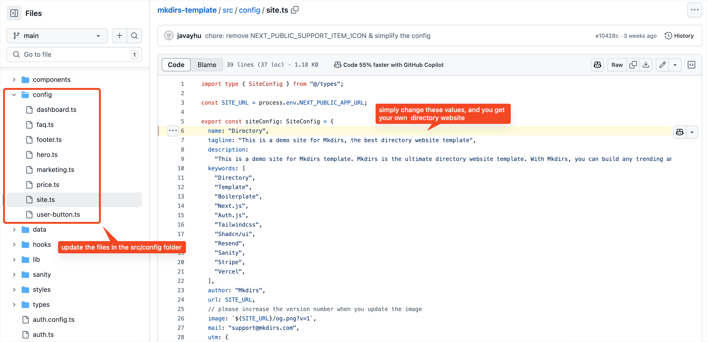
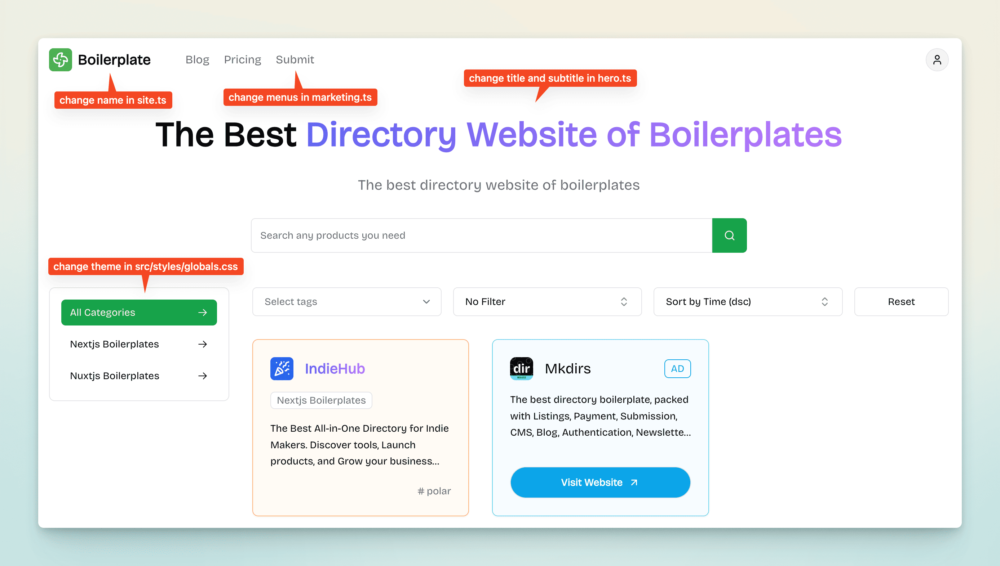

打开 `src/config` 文件夹，您可以看到 `site.ts` 文件。

您可以在这里自定义导航站的信息，也可以在 `config` 文件夹中的其他文件中自定义其他信息，例如菜单栏、底部链接等。

## 视频教程

### 自定义导航站信息- 开发者教程

  <iframe 
    style="position: absolute; top: 0; left: 0; width: 100%; height: 100%;" 
    width="1280" 
    height="720" 
    src="https://www.youtube.com/embed/GRf3fC4nCXU?list=PLVBbrIi208W-yprj2E6oXu-yxB3Ou522u" 
    title="【8/9】自定义文案 + LOGO + 主题 —— 基于Mkdirs模板部署上线导航站的全流程记录" 
    frameborder="0" 
    allow="accelerometer; autoplay; clipboard-write; encrypted-media; gyroscope; picture-in-picture; web-share" 
    referrerpolicy="strict-origin-when-cross-origin" 
    allowfullscreen
  ></iframe>

### 自定义导航站信息- 初学者教程

  <iframe 
    style="position: absolute; top: 0; left: 0; width: 100%; height: 100%;" 
    width="1280" 
    height="720" 
    src="https://www.youtube.com/embed/aRR8R5V1fpQ?list=PLVBbrIi208W9pRjN9dVE8f9pzd6KJrTaw" 
    title="11、导航站自定义" 
    frameborder="0" 
    allow="accelerometer; autoplay; clipboard-write; encrypted-media; gyroscope; picture-in-picture; web-share" 
    referrerpolicy="strict-origin-when-cross-origin" 
    allowfullscreen
  ></iframe>

