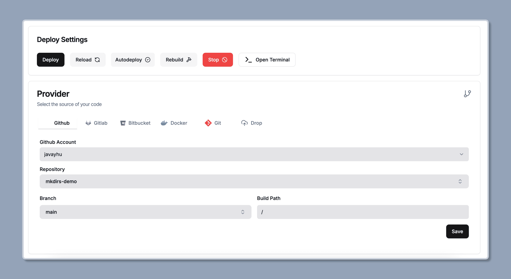

import { Aside } from '@astrojs/starlight/components';
import { Steps } from '@astrojs/starlight/components';

我推荐使用 [Dokploy](https://dokploy.com/) 部署 Mkdirs，因为它更容易设置整个过程，并且你还可以获得像 Vercel 一样的 CI/CD 自动流程。

## 在 Dokploy 上部署

<Steps>

1. 在 Dokploy 上创建一个新项目

    点击 `Create project` 按钮，并设置项目名称和描述。

2. 在项目中创建一个应用

    点击 `Create services` 按钮，并选择 `Application`，然后设置应用名称和描述。

3. 设置源码和构建类型

    将源码设置为仓库，并将构建类型设置为 Dockerfile。

    

    

4. 设置环境变量

    复制 `.env` 文件中的内容，并将其粘贴到环境变量设置中。

    <Aside type="caution">
        1. 注意，开发环境和生产环境的环境变量不同。
        2. 请在环境变量中添加 `AUTH_TRUST_HOST=true`。
        3. 请在环境变量中添加 `AUTH_URL=https://your-domain.com/api/auth`。
    </Aside>

     

5. 开始部署

    点击 `Deploy`，并等待部署完成。

    

6. 设置域名

    添加你想要使用的域名，并确保勾选 `HTTPS`。

    

7. 完成

    部署完成后，访问你设置的域名，检查应用是否正常运行。

</Steps>
