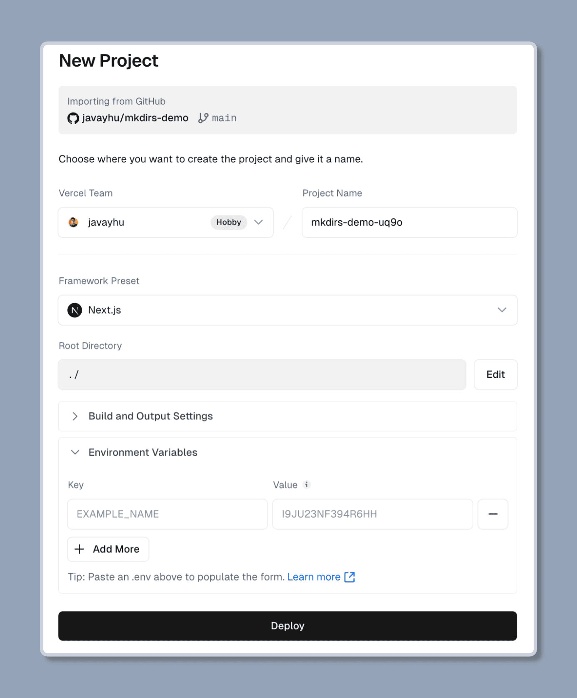
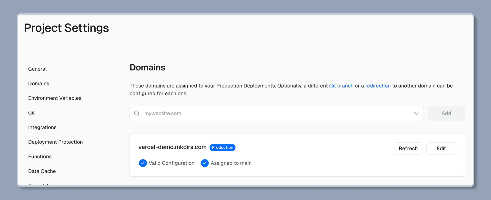
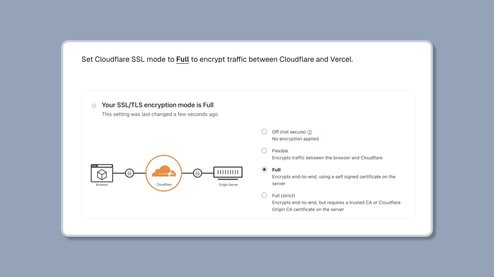

import { Steps } from '@astrojs/starlight/components';

你可以轻松地将 Mkdirs 部署到 [Vercel](https://vercel.com/)。

## 在 Vercel 上部署

<Steps>

1. 在 [Vercel](https://vercel.com/) 上创建一个账户

    如果你还没有 Vercel 账户，请按照他们的步骤进行 [注册](https://vercel.com/signup)。

2. 创建一个新项目

    点击 `Add New Project` 按钮，并选择你的 GitHub 仓库，然后点击 `Import` 按钮。

3. 设置环境变量

    复制并粘贴 `.env` 文件中的环境变量到 `Environment Variables` 部分，然后点击 `Deploy` 按钮。

    

4. 设置域名

    在 `Domains` 部分添加你想要使用的域名，并添加 DNS 记录到你的域名提供商，然后等待 DNS 记录生效。

    

5. 完成

    等待部署完成，你的目录网站应该已经上线。

</Steps>

## 常见问题

- **Q: 如何使用 Cloudflare 作为反向代理？**

  A: 请按照 [这里](https://vercel.com/docs/integrations/external-platforms/cloudflare#set-cloudflare-ssl/tls-encryption-mode) 的步骤使用 Cloudflare 作为反向代理。

  如果你遇到 `Error: Too many redirects`，可以尝试将 SSL 模式设置为 `Full`。

  

## 视频教程

{/* https://www.youtube.com/embed/_3ZyJRdACzw?list=PLVBbrIi208W-yprj2E6oXu-yxB3Ou522u */}

  <iframe 
    style="position: absolute; top: 0; left: 0; width: 100%; height: 100%;" 
    width="1280" 
    height="720" 
    src="https://www.youtube.com/embed/_3ZyJRdACzw?list=PLVBbrIi208W-yprj2E6oXu-yxB3Ou522u" 
    title="【7/9】部署到Vercel + 开启访问后台Studio —— 基于Mkdirs模板部署上线导航站的全流程记录" 
    frameborder="0" 
    allow="accelerometer; autoplay; clipboard-write; encrypted-media; gyroscope; picture-in-picture; web-share" 
    referrerpolicy="strict-origin-when-cross-origin" 
    allowfullscreen
  ></iframe>

