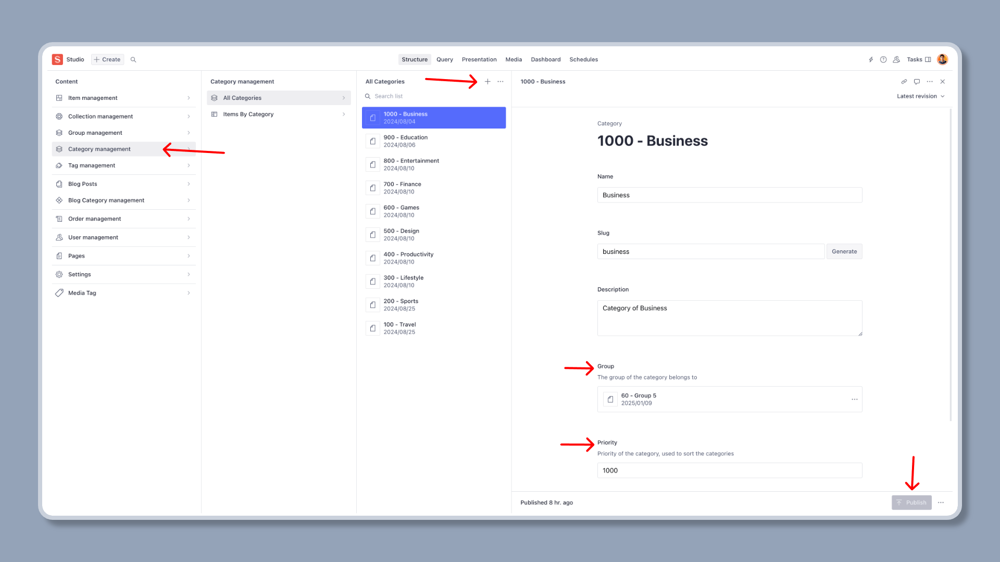
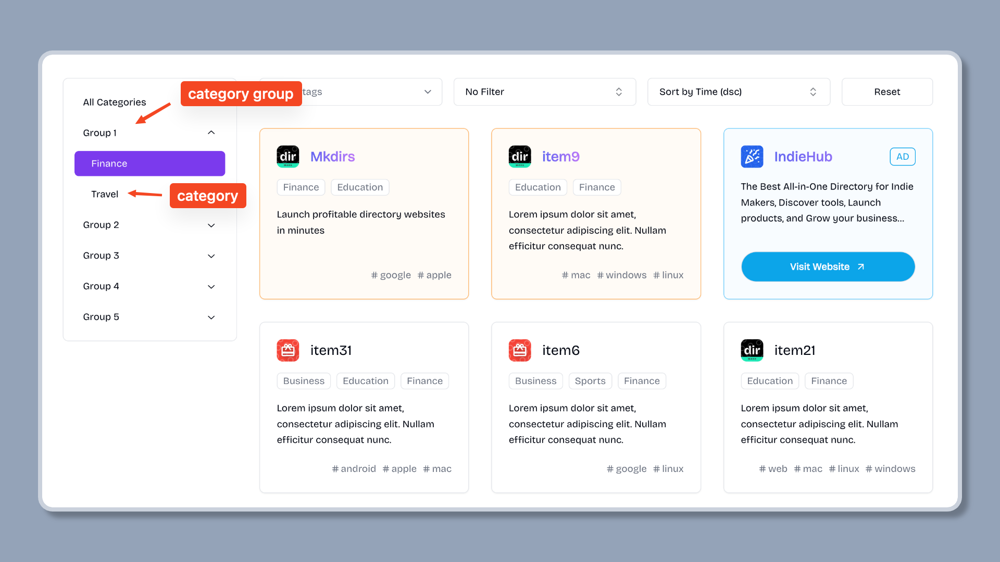

import { Aside } from '@astrojs/starlight/components';

## 添加分类

进入Sanity Studio，点击 `Category Management` 按钮，然后点击 `+` 按钮。

输入分类名称，生成slug，设置描述和优先级，然后点击 `Publish` 按钮。



<Aside type="note">
    如果您想将分类分组，您应该先添加分类组，然后您可以将分类分配到分类组。
</Aside>

分类发布后，您可以在网站上看到分类列表，如下所示。


## 添加分类组

进入Sanity Studio，点击 `Group Management` 按钮，然后点击 `+` 按钮。

输入组名称，生成slug，设置描述和优先级，然后点击 `Publish` 按钮。


<Aside type="note">
    请确保您已将分类分配到组中，您可以通过编辑分类信息来完成此操作。
</Aside>

分类组发布后，您可以在网站上看到组列表，如下所示。




分类组是默认支持的，如果您不想显示组，您可以通过在 `src/lib/constants.ts` 文件中将 `SUPPORT_CATEGORY_GROUP` 设置为 `false` 来禁用它。

```ts
// support category group, default is true (aka, show category group)
// NOTE: if you set true, you should make sure each category belongs to a group
// if you set false, the category will be shown in the root level
export const SUPPORT_CATEGORY_GROUP = false;
```
