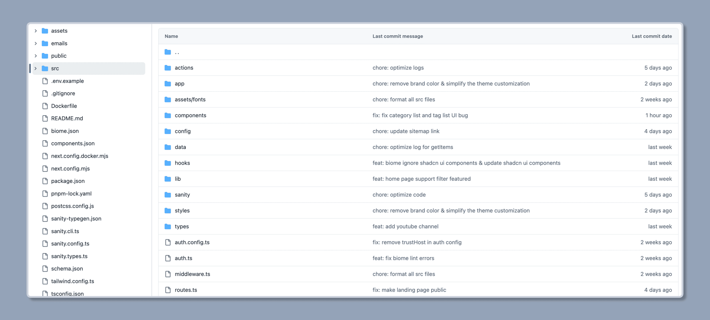
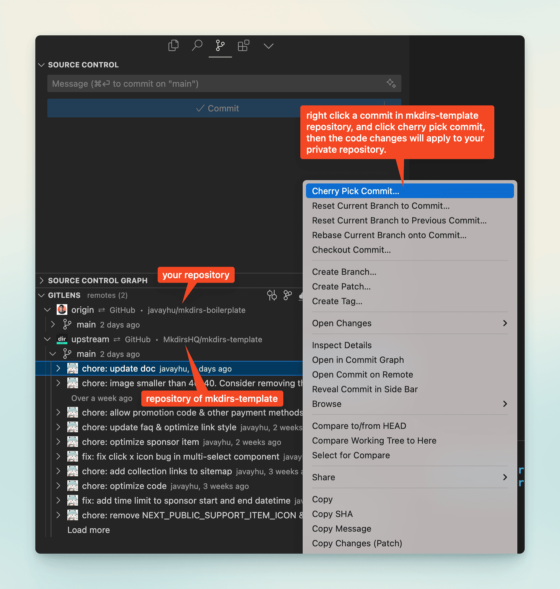

import { Aside } from '@astrojs/starlight/components';
import { Steps } from '@astrojs/starlight/components';

## 文件结构

Mkdirs 是一个使用 [Typescript](https://www.typescriptlang.org/) 语言开发的 [Next.js](https://nextjs.org/) 项目，因此 Mkdirs 的文件结构如下：



## 应用架构


## 如何查找日志

如果您遇到一些错误，您可以在浏览器的 `console` 中找到日志（如果它是客户端错误），或者在服务器的 `terminal` 中找到日志（如果它是服务器错误）。

如果您使用 Vercel 部署您的网站，您可以在 Vercel 仪表板中的 `Logs` 部分找到日志。

**浏览器控制台日志**


**Vercel 日志**


## 如何批量导入数据

Mkdirs 使用 [Sanity](https://www.sanity.io/) 作为内容管理系统，因此如果你想要批量导入数据，那么你需要将数据导入到 Sanity，导入之前建议您先阅读 [Sanity 文档](/zh-cn/guide/sanity) 中提供的资料了解 Sanity 的基本概念和用法。

如果你已经熟悉了 Sanity，那么你可以参考项目根目录下的 `scripts` 目录下的脚本，实现批量导入分类、标签和元素。

默认情况下，项目根目录下的 `scripts` 目录下有 `batch-group.ts`、`batch-category.ts`、 `batch-tag.ts` 和 `batch-item.ts` 四个脚本，分别用于导入分类组、分类、标签和元素。

你可以在新建项目之后，通过执行命令 `pnpm batch` 来测试导入数据，脚本目录下还提供了其他脚本，您可以参考它们实现自己的需求，对应命令请参考 [`package.json` 文件中的 `scripts` 部分](https://github.com/MkdirsHQ/mkdirs-template/blob/main/package.json#L27)。

```json
"scripts": {
    "dev": "next dev",
    "build": "next build",
    "start": "next start",
    "lint": "next lint",
    "typegen": "sanity schema extract && sanity typegen generate",
    "email": "email dev --dir emails --port 3333",
    "export-user-emails": "tsx scripts/export-user-emails.ts",
    "microlink:fetch": "tsx scripts/explore-microlink.ts fetch",
    "microlink:insights": "tsx scripts/explore-microlink.ts insights",
    "microlink:screenshot": "tsx scripts/explore-microlink.ts screenshot",
    "microlink:fullpage": "tsx scripts/explore-microlink.ts fullpage",
    "aisdk:fetch": "tsx scripts/explore-aisdk.ts fetch",
    "aisdk:structure": "tsx scripts/explore-aisdk.ts structure",
    "item:remove": "tsx scripts/batch-item.ts remove",
    "item:import": "tsx scripts/batch-item.ts import",
    "item:update": "tsx scripts/batch-item.ts update",
    "item:fetch": "tsx scripts/batch-item.ts fetch",
    "batch": "tsx scripts/batch-all.ts",
    "batch:remove": "tsx scripts/batch-all.ts remove",
    "batch:import": "tsx scripts/batch-all.ts import",
    "batch:update": "tsx scripts/batch-all.ts update"
},
```

<Aside type="caution">
    1、默认情况下这些脚本并不能完全满足你的需求，这些脚本只是提供了一个基本的实现，你需要根据实际情况进行调整。  
    2、脚本目录下还有些脚本是用来测试 [Vercel AI SDK](https://sdk.vercel.ai/) 和 [Microlink](https://microlink.io/) 的接口的，你可以参考它们实现自己的定制需求。
</Aside>

## 如何格式化代码

我们使用 [Biome](https://biomejs.dev/) 来格式化代码，并且已经在项目中配置好了。

您可以在 vscode 中安装 [Biome 扩展](https://marketplace.visualstudio.com/items?itemName=biomejs.biome) 来自动格式化代码。

或者您可以运行以下命令来格式化代码：

```bash
biome format
```

## 如何同步源码

如果您按照 [安装](/zh-cn/installation) 中的步骤操作，并且有一个名为 `@your-github-username/your-mkdirs` 的仓库。

按照以下步骤从 `@MkdirsHQ/mkdirs-template` 同步源码到您的仓库，例如，新功能或错误修复。

<Steps>

1. 添加上游仓库

    首先，您需要将原始仓库添加为远程仓库。
    
    您可以将其命名为 `upstream`，然后在本地仓库中运行以下命令：

    ```bash
    git remote add upstream https://github.com/MkdirsHQ/mkdirs-template.git
    ```

2. 获取上游仓库的更改
    
    运行以下命令以获取原始仓库中的所有分支和提交：

    ```bash
    git fetch upstream
    ```

3. 切换到您的 `main` 分支
    
    确保您在 `main` 分支上（通常是 `main` 或 `master`）：

    ```bash
    git checkout main
    ```

4. 合并上游更改
    
    现在，将上游 `main` 分支的更改合并到您的本地 `main` 分支：

    ```bash
    git merge upstream/main --allow-unrelated-histories
    ```

    如果您不想合并上游 `main` 分支的所有更改，您也可以选择性地挑选您想要应用到本地 `main` 分支的特定提交：

    ```bash
    git cherry-pick <commit-hash>
    ```

    

5. 解决冲突（如果有）

    如果在合并过程中发生冲突（主要是因为您已经对源码进行了一些更改），您需要手动解决它们。
    
    解决冲突后，使用 `git add` 添加修改的文件，然后使用 `git commit` 提交更改。

6. 推送到您的仓库
    
    最后，将更新后的本地 `main` 分支推送到您自己的仓库：

    ```bash
    git push origin main
    ```

</Steps>

按照这些步骤，您可以保持您的分支与原始仓库同步。建议定期执行此过程，以确保您的分支不会落后太多。

## 延伸阅读

- [Next.js](https://nextjs.org/)
- [Course: Learn React Foundation](https://nextjs.org/learn/react-foundations)
- [Course: Learn Next.js](https://nextjs.org/learn)
