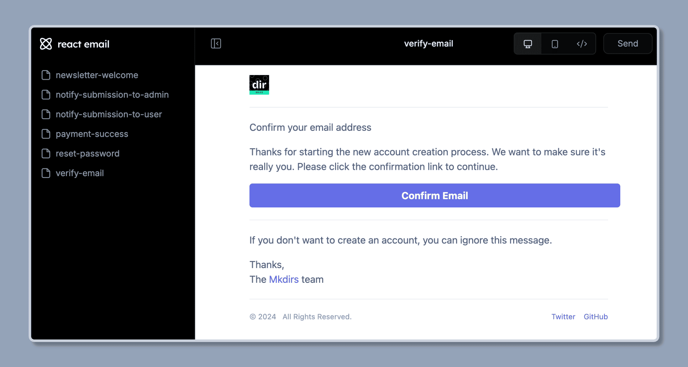

## 启动邮件预览服务器

运行以下命令启动邮件预览服务器，您可以看到邮件预览服务器运行在 `http://localhost:3333`。

```bash
pnpm email
```



## 更改或添加新的邮件模板

邮件模板文件位于 `emails` 文件夹中，您可以更改邮件模板文件为自己的邮件模板。

或者您可以添加新的邮件模板文件到 `emails` 文件夹中，然后在浏览器中预览邮件模板。

## 视频教程

<div style="position: relative; padding-bottom: 56.25%; height: 0; overflow: hidden;">
  <iframe 
    style="position: absolute; top: 0; left: 0; width: 100%; height: 100%;" 
    width="1280" 
    height="720" 
    src="https://www.youtube.com/embed/Fe-DjXxh0r8?list=PLVBbrIi208W-yprj2E6oXu-yxB3Ou522u" 
    title="【9/9】自定义邮件内容 —— 基于Mkdirs模板部署上线导航站的全流程记录" 
    frameborder="0" 
    allow="accelerometer; autoplay; clipboard-write; encrypted-media; gyroscope; picture-in-picture; web-share" 
    referrerpolicy="strict-origin-when-cross-origin" 
    allowfullscreen
  ></iframe>
</div>

