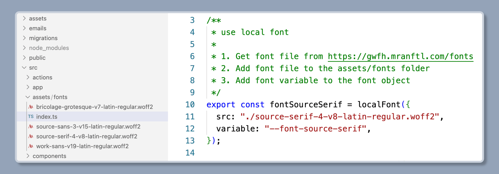
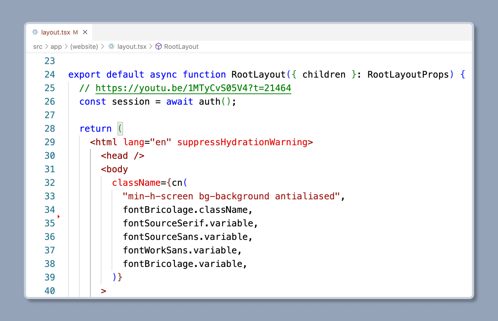

The font file is in the `src/assets/fonts` folder, you can add your custom font file to the `fonts` folder, and define the font in `src/assets/fonts/index.ts`.

Then you can use the font in the `src/app/(website)/layout.tsx` file.

