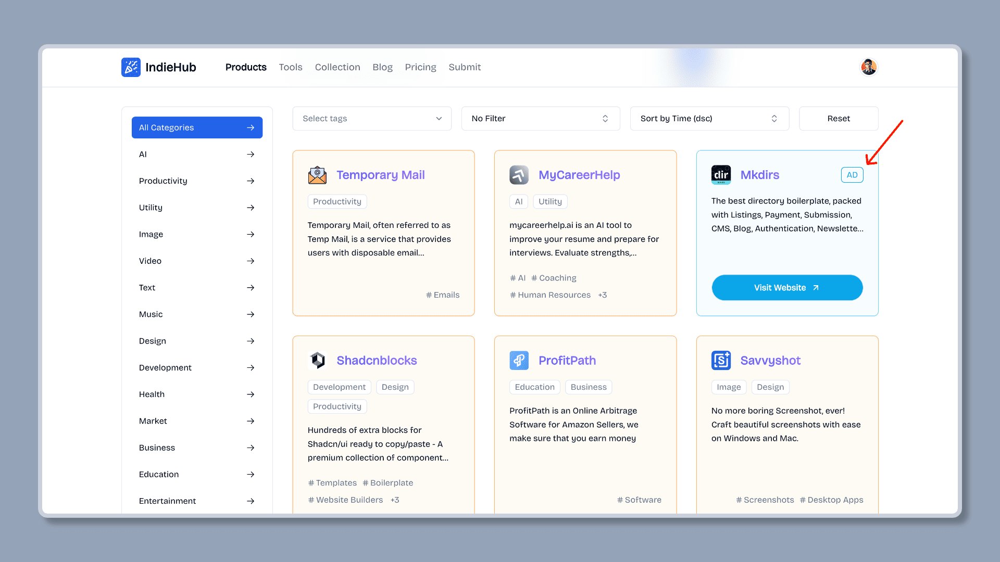
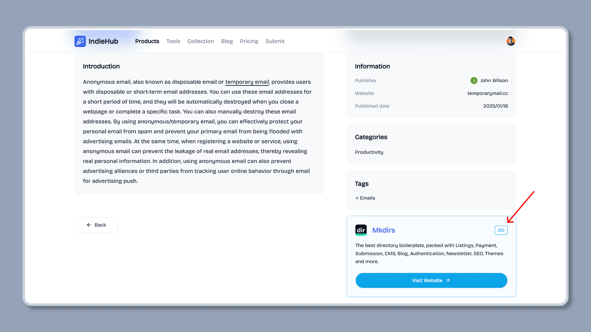

import { Aside } from '@astrojs/starlight/components';
import { Steps } from '@astrojs/starlight/components';

赞助广告是导航站的主要收入来源之一，赞助广告会显示在导航站的列表中或者详情页中。Mkdirs 模板支持赞助广告的提交和显示，同一时间最多显示一个赞助广告，默认的显示赞助广告的流程如下。

## 显示赞助广告的流程

<Steps>

1. 用户填写提交表单，并支付赞助费用

    用户点击导航站的 "提交" 按钮，并填写表单，然后支付赞助费用。

    <Aside type='caution'>
        请确保您在 `.env` 文件中设置了 `NEXT_PUBLIC_STRIPE_SPONSOR_PRICE_ID`，以便赞助价格计划在 `Payment` 页面中显示，请参阅 [Stripe](/configuration/stripe) 配置部分了解更多信息。
    </Aside>

    

2. 管理员与用户沟通，赞助广告的显示时间

    管理员与用户沟通广告的显示时间，确定后在 Sanity Studio 中设置赞助广告的显示时间，同时勾选设置这个 Item 是`Sponsor`。

    <Aside type='caution'>
        导航站模板暂不支持用户直接设置赞助广告的显示时间，需要管理员与用户进行沟通，确定时间后手动设置赞助广告的显示时间。原因是赞助广告的显示时间需要根据当前导航站的赞助广告的数量和时间来确定的，目前模板最多显示一个赞助广告，所以需要管理员手动设置赞助广告的显示时间，避免赞助广告的显示时间冲突。
    </Aside>

    

    

3. 导航站自动显示赞助广告

    赞助广告的显示时间设置完成后，导航站将自动在指定的时间内显示赞助广告。

    

    

</Steps>

