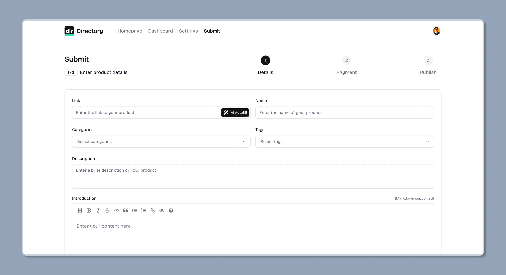
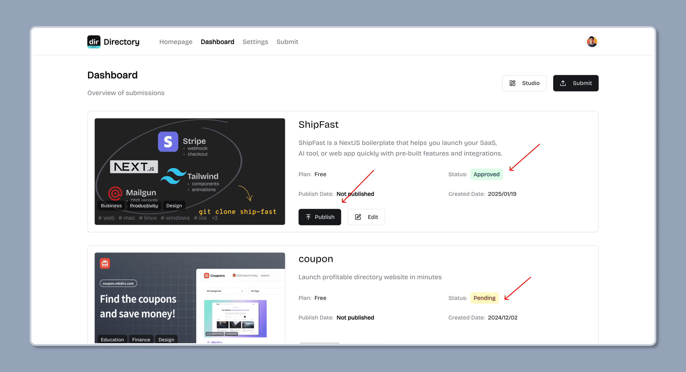

import { Aside } from '@astrojs/starlight/components';
import { Steps } from '@astrojs/starlight/components';

## 用户如何提交新内容

<Steps>

1. 用户填写提交表单

    用户点击导航站的 "提交" 按钮，并填写表单，然后提交审核。

    <Aside type="tip">
        提交表单支持 AI 自动填充，用户可以点击 "AI 自动填充" 按钮，让 AI 填充表单，或者手动填写表单。
    </Aside>

    

2. 管理员审核提交，并批准或拒绝

    管理员将审核提交，并批准或拒绝，如果拒绝，将传递拒绝消息给用户。

    

3. 用户发布提交

    在提交被批准后，用户可以点击 "发布" 按钮，将提交发布到导航站，发布后，内容将显示在导航站中。

    

</Steps>

## 管理员如何提交新内容

管理员可以像用户一样，点击导航站的 "提交" 按钮，或者直接在 Sanity Studio 中添加新内容。

请确保设置 `发布日期` (Publish Date) 和 `免费计划状态` (Free Plan Status) 字段为 `已批准` (Approved) ，然后发布。

发布后，内容将显示在导航站中。