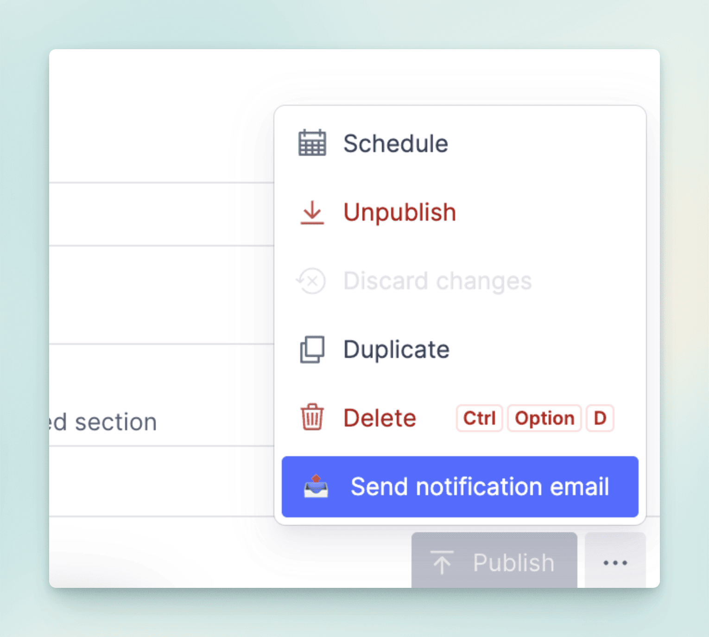

import { Aside } from '@astrojs/starlight/components';
import { Steps } from '@astrojs/starlight/components';

## 免费提交流程

### 用户如何提交新内容

<Steps>

1. 用户填写提交表单

    用户点击导航站的 "提交" 按钮，并填写表单，然后提交审核。

    <Aside type="tip">
        提交表单支持 AI 自动填充，用户可以点击 "AI 自动填充" 按钮，让 AI 填充表单，或者手动填写表单。
    </Aside>

    

2. 管理员审核提交，并批准或拒绝

    管理员将审核提交，并批准或拒绝，如果拒绝，将传递拒绝消息给用户。

    

    <Aside type="tip">
        20250215更新，管理员审核提交时，不论是 通过 还是 拒绝 后，都可以点击 `Send notification email` 按钮，发送邮件通知给提交的用户。
    </Aside>

    

3. 用户发布提交

    在提交被批准后，用户可以点击 "发布" 按钮，将提交发布到导航站，发布后，内容将显示在导航站中。

    

</Steps>

### 管理员如何提交新内容

管理员可以像用户一样，点击导航站的 "提交" 按钮，或者直接在 Sanity Studio 中添加新内容。

请确保设置 `发布日期` (Publish Date) 和 `免费计划状态` (Free Plan Status) 字段为 `已批准` (Approved) ，然后发布。

发布后，内容将显示在导航站中。

## 付费提交流程

付费提交是导航站的主要收入来源之一，付费提交的内容会显示在导航站的列表中高亮显示。

用户点击导航站的 "提交" 按钮，并填写表单，然后支付 `PRO` 费用，支付完成后，默认情况下管理员无需审核直接通过，用户可以立即发布或者等待合适的时机发布产品。

## 视频教程

这个视频教程演示了如何进行免费提交和付费提交的流程。

  <iframe 
    style="position: absolute; top: 0; left: 0; width: 100%; height: 100%;" 
    width="1280" 
    height="720" 
    src="https://www.youtube.com/embed/JQtxt0WQEHg" 
    title="12、线上运行功能测试" 
    frameborder="0" 
    allow="accelerometer; autoplay; clipboard-write; encrypted-media; gyroscope; picture-in-picture; web-share" 
    referrerpolicy="strict-origin-when-cross-origin" 
    allowfullscreen
  ></iframe>

这个视频演示了如何使用 AI 模型自动填充提交表单的功能流程。

  <iframe 
    style="position: absolute; top: 0; left: 0; width: 100%; height: 100%;" 
    width="1280" 
    height="720" 
    src="https://www.youtube.com/embed/SWTQwA4HEQ0" 
    title="AI submissions with Google Gemini, DeepSeek, and OpenAI models" 
    frameborder="0" 
    allow="accelerometer; autoplay; clipboard-write; encrypted-media; gyroscope; picture-in-picture; web-share" 
    referrerpolicy="strict-origin-when-cross-origin" 
    allowfullscreen
  ></iframe>

